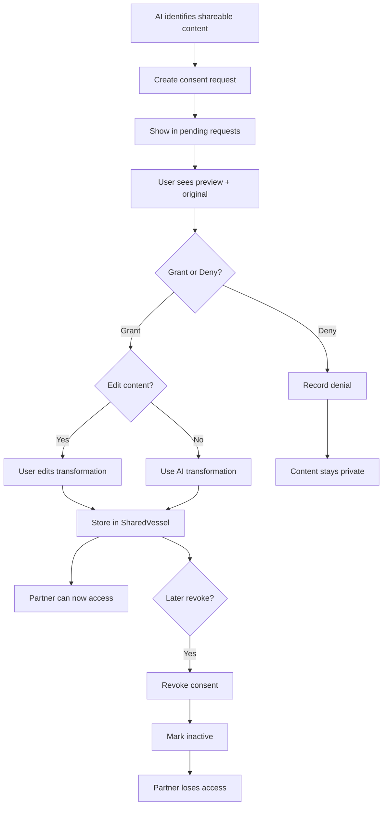

# Consent API

Endpoints for the Consensual Bridge mechanism - controlling what data is shared with partner.

## Core Principle

> Nothing moves from UserVessel to SharedVessel without explicit consent.

See [Consensual Bridge Mechanism](../../mechanisms/consensual-bridge.md) for the full design.

---

## Get Pending Consent Requests

Get consent requests awaiting user decision.

```
GET /api/v1/sessions/:id/consent/pending
```

### Response

```typescript
interface GetPendingConsentsResponse {
  pendingRequests: ConsentRequestDTO[];
}

interface ConsentRequestDTO {
  id: string;
  contentType: ConsentContentType;
  contentDescription: string;

  // Preview of what partner would see
  transformedPreview: string;

  // Reference to original content
  originalContentId: string;
  originalContentSummary: string;
}

enum ConsentContentType {
  IDENTIFIED_NEED = 'IDENTIFIED_NEED',
  EVENT_SUMMARY = 'EVENT_SUMMARY',
  EMOTIONAL_PATTERN = 'EMOTIONAL_PATTERN',
  BOUNDARY = 'BOUNDARY',
  EMPATHY_DRAFT = 'EMPATHY_DRAFT',
  EMPATHY_ATTEMPT = 'EMPATHY_ATTEMPT',
  STRATEGY_PROPOSAL = 'STRATEGY_PROPOSAL'
}
```

### Example Response

```json
{
  "success": true,
  "data": {
    "pendingRequests": [
      {
        "id": "consent_req_001",
        "contentType": "IDENTIFIED_NEED",
        "contentDescription": "Your need for recognition in household tasks",
        "transformedPreview": "Partner has identified a need to feel recognized for their contributions at home.",
        "originalContentId": "need_123",
        "originalContentSummary": "I need to feel like my efforts at home are seen and appreciated..."
      }
    ]
  }
}
```

---

## Decide on Consent Request

Grant or deny a consent request.

```
POST /api/v1/sessions/:id/consent/decide
```

### Request Body

```typescript
interface DecideConsentRequest {
  consentRequestId: string;
  decision: 'GRANTED' | 'DENIED';

  // Optional: edit transformed content before sharing
  editedContent?: string;
}
```

### Response

```typescript
interface DecideConsentResponse {
  recorded: boolean;
  consentRecord: ConsentRecordDTO;

  // If granted, the shared content
  sharedContent?: ConsentedContentDTO;
}
```

### Example: Granting with Edit

```bash
curl -X POST /api/v1/sessions/sess_abc123/consent/decide \
  -H "Authorization: Bearer <token>" \
  -d '{
    "consentRequestId": "consent_req_001",
    "decision": "GRANTED",
    "editedContent": "I have a need to feel recognized for my contributions at home."
  }'
```

```json
{
  "success": true,
  "data": {
    "recorded": true,
    "consentRecord": {
      "id": "consent_rec_001",
      "contentType": "IDENTIFIED_NEED",
      "decision": "GRANTED",
      "decidedAt": "2024-01-16T17:30:00Z",
      "revokedAt": null,
      "contentDescription": "Your need for recognition in household tasks"
    },
    "sharedContent": {
      "id": "shared_001",
      "sourceUserId": "user_456",
      "transformedContent": "I have a need to feel recognized for my contributions at home.",
      "consentedAt": "2024-01-16T17:30:00Z",
      "consentActive": true
    }
  }
}
```

### Transformation

Content is **always transformed** before sharing:

| Original (Private) | Transformed (Shared) |
|--------------------|----------------------|
| "They never help with anything!" | Need for support with household tasks |
| "I'm so angry when they ignore me" | Need to feel heard and acknowledged |
| Raw emotional venting | Abstracted need statement |

The AI generates the transformation. Users can edit before sharing.

---

## Revoke Consent

Revoke previously granted consent.

```
POST /api/v1/sessions/:id/consent/revoke
```

### Request Body

```typescript
interface RevokeConsentRequest {
  consentRecordId: string;
}
```

### Response

```typescript
interface RevokeConsentResponse {
  revoked: boolean;
  revokedAt: string;
}
```

### Side Effects

1. `ConsentRecord.revokedAt` set to current timestamp
2. `ConsentedContent.consentActive` set to false
3. Partner can no longer access this content
4. Content is **not deleted** - just marked inactive
5. Derived objects become stale:
   - CommonGround items based on revoked needs must be excluded/recomputed
   - Agreements referencing revoked strategy proposals remain but should flag stale input
   - EmpathyAttempt visibility revoked for partner immediately

### Important Notes

- Revocation is **immediate** - partner loses access on next request
- Content already seen by partner cannot be "unseen"
- Revocation is recorded in audit trail

---

## Get Consent History

Get all consent decisions for a session.

```
GET /api/v1/sessions/:id/consent/history
```

### Response

```typescript
interface GetConsentHistoryResponse {
  records: ConsentRecordDTO[];
}
```

---

## When Consent is Required

Consent is requested when the AI determines content should be shared:

| Stage | Trigger | Content Type |
|-------|---------|--------------|
| Stage 2 | Building empathy attempt | EVENT_SUMMARY |
| Stage 2 | Sharing empathy attempt | (handled by empathy endpoints) |
| Stage 3 | Sharing identified needs | IDENTIFIED_NEED |
| Stage 3 | Sharing boundaries | BOUNDARY |

---

## Consent Flow Diagram



---

## Retrieval with Consent

When retrieving partner content, consent is verified:

```sql
SELECT cc."transformedContent"
FROM "ConsentedContent" cc
JOIN "ConsentRecord" cr ON cc."consentRecordId" = cr.id
WHERE cc."sharedVesselId" = $sharedVesselId
  AND cc."sourceUserId" = $partnerId
  AND cr.decision = 'GRANTED'
  AND cr."revokedAt" IS NULL
  AND cc."consentActive" = true;
```

See [Retrieval Contracts](../state-machine/retrieval-contracts.md#consent-verification).

---

## Related Documentation

- [Consensual Bridge Mechanism](../../mechanisms/consensual-bridge.md)
- [Stage 2 API](./stage-2.md) - Empathy exchange consent
- [Retrieval Contracts](../state-machine/retrieval-contracts.md)
- [Privacy Model](../../privacy/vessel-model.md)

---

[Back to API Index](./index.md) | [Back to Backend](../index.md)
