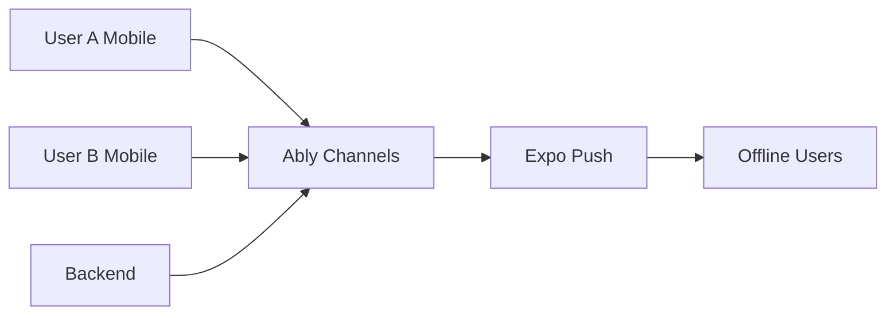

# Realtime Integration

Ably-powered real-time updates for partner status and session events.

## Overview

BeHeard uses [Ably](https://ably.com) for real-time communication:
- **Presence**: Know when partner is online/active
- **Pub/Sub**: Instant notifications of partner actions
- **Push**: Expo Push Notifications for offline users

## Architecture



## Channel Structure

### Session Channel

Each session has a private channel:

```
beheard:session:{sessionId}
```

Both participants subscribe to this channel for session-level events.

### User Presence Channel

For knowing if partner is actively in the app:

```
beheard:session:{sessionId}:presence
```

## Events

### Session Events

Published by backend to session channel:

| Event | Payload | Description |
|-------|---------|-------------|
| `partner.signed_compact` | `{ signedAt }` | Partner signed Curiosity Compact |
| `partner.stage_completed` | `{ stage, completedAt }` | Partner completed a stage |
| `partner.advanced` | `{ toStage }` | Partner advanced to new stage |
| `partner.empathy_shared` | `{ }` | Partner consented to share empathy |
| `partner.needs_shared` | `{ }` | Partner shared their needs |
| `partner.ranking_submitted` | `{ }` | Partner submitted strategy ranking |
| `agreement.proposed` | `{ agreementId }` | New agreement proposed |
| `agreement.confirmed` | `{ agreementId }` | Agreement confirmed by both |
| `session.paused` | `{ by, reason }` | Session paused |
| `session.resumed` | `{ }` | Session resumed |
| `session.resolved` | `{ }` | Session resolved |

### Presence Events

Ably presence provides automatically:

| Event | Description |
|-------|-------------|
| `enter` | User became active in session |
| `leave` | User left session view |
| `update` | User's state changed |

### Presence Data

When entering presence, include:

```typescript
interface PresenceData {
  userId: string;
  stage: number;
  status: StageStatus;
  lastActive: string;
}
```

## Client Integration

### Connecting to Ably

```typescript
import * as Ably from 'ably';

const ably = new Ably.Realtime({
  authCallback: async (tokenParams, callback) => {
    // Get token from backend
    const response = await fetch('/api/v1/auth/ably-token', {
      headers: { Authorization: `Bearer ${authToken}` }
    });
    const tokenRequest = await response.json();
    callback(null, tokenRequest.data);
  }
});
```

### Subscribing to Session

```typescript
const channel = ably.channels.get(`beheard:session:${sessionId}`);

channel.subscribe('partner.stage_completed', (message) => {
  const { stage, completedAt } = message.data;
  // Update UI to show partner completed stage
});

channel.subscribe('partner.empathy_shared', () => {
  // Fetch partner's empathy attempt
  fetchPartnerEmpathy();
});
```

### Presence

```typescript
const presenceChannel = ably.channels.get(
  `beheard:session:${sessionId}:presence`
);

// Enter presence when viewing session
presenceChannel.presence.enter({
  userId: currentUserId,
  stage: currentStage,
  status: 'IN_PROGRESS'
});

// Listen for partner presence
presenceChannel.presence.subscribe('enter', (member) => {
  if (member.clientId !== currentUserId) {
    setPartnerOnline(true);
  }
});

presenceChannel.presence.subscribe('leave', (member) => {
  if (member.clientId !== currentUserId) {
    setPartnerOnline(false);
  }
});
```

## Backend Publishing

### Publishing Events

```typescript
import * as Ably from 'ably';

const ably = new Ably.Rest(process.env.ABLY_API_KEY);

async function publishPartnerStageCompleted(
  sessionId: string,
  stage: number
) {
  const channel = ably.channels.get(`beheard:session:${sessionId}`);
  await channel.publish('partner.stage_completed', {
    stage,
    completedAt: new Date().toISOString()
  });
}
```

### Presence-Based Routing

Before publishing, check if partner is online:

```typescript
async function notifyPartner(sessionId: string, event: string, data: any) {
  const presenceChannel = ably.channels.get(
    `beheard:session:${sessionId}:presence`
  );

  const members = await presenceChannel.presence.get();
  const partnerPresent = members.some(m => m.clientId === partnerId);

  if (partnerPresent) {
    // Partner online - publish to Ably
    const channel = ably.channels.get(`beheard:session:${sessionId}`);
    await channel.publish(event, data);
  } else {
    // Partner offline - send push notification
    await sendPushNotification(partnerId, event, data);
  }
}
```

## Push Notifications

### When Partner is Offline

Use Expo Push Notifications:

```typescript
import { Expo } from 'expo-server-sdk';

const expo = new Expo();

async function sendPushNotification(
  userId: string,
  event: string,
  data: any
) {
  const user = await getUser(userId);
  if (!user.pushToken) return;

  const message = getPushMessage(event, data);

  await expo.sendPushNotificationsAsync([{
    to: user.pushToken,
    sound: 'default',
    title: message.title,
    body: message.body,
    data: { sessionId: data.sessionId, event }
  }]);
}

function getPushMessage(event: string, data: any) {
  const messages: Record<string, { title: string; body: string }> = {
    'partner.signed_compact': {
      title: 'Partner is ready',
      body: 'They signed the Curiosity Compact. Your turn!'
    },
    'partner.stage_completed': {
      title: 'Partner finished a stage',
      body: 'They completed their work. Check in when ready.'
    },
    'partner.empathy_shared': {
      title: 'Partner shared their understanding',
      body: 'See how they understand your perspective.'
    },
    'agreement.proposed': {
      title: 'New experiment proposed',
      body: 'Review and confirm the agreement.'
    }
  };

  return messages[event] || { title: 'BeHeard', body: 'You have an update' };
}
```

### Storage and rate limits
- Push tokens are stored on `User.pushToken` (optional) and updated on login.
- Nudge/reminder actions must be rate limited (e.g., 1 per 6 hours per partner) and logged.
- If push token is missing, fall back to Ably only; do not error.

## Auth Token Endpoint

Backend endpoint for Ably token requests:

```
GET /api/v1/auth/ably-token
```

### Response

```typescript
interface AblyTokenResponse {
  token: string;
  expires: number;
  capability: Record<string, string[]>;
}
```

### Capability

Tokens are scoped to user's sessions:

```typescript
function generateAblyCapability(userId: string, sessionIds: string[]) {
  const capability: Record<string, string[]> = {};

  for (const sessionId of sessionIds) {
    capability[`beheard:session:${sessionId}`] = ['subscribe', 'publish'];
    capability[`beheard:session:${sessionId}:presence`] = ['presence'];
  }

  return capability;
}
```

## Error Handling

### Connection Recovery

```typescript
ably.connection.on('disconnected', () => {
  setConnectionStatus('reconnecting');
});

ably.connection.on('connected', () => {
  setConnectionStatus('connected');
  // Resync state after reconnection
  refetchSessionState();
});
```

### Fallback to Polling

If Ably connection fails, fall back to polling:

```typescript
const POLL_INTERVAL = 10000; // 10 seconds

useEffect(() => {
  if (connectionStatus === 'failed') {
    const interval = setInterval(() => {
      refetchSessionState();
    }, POLL_INTERVAL);
    return () => clearInterval(interval);
  }
}, [connectionStatus]);
```

## Related Documentation

- [Architecture: Realtime](../overview/architecture.md#realtime-layer-presence-based-notifications)
- [Session States](../state-machine/index.md)
- [Push Notifications Setup](../../deployment/push-notifications.md)

---

[Back to API Index](./index.md) | [Back to Backend](../index.md)
