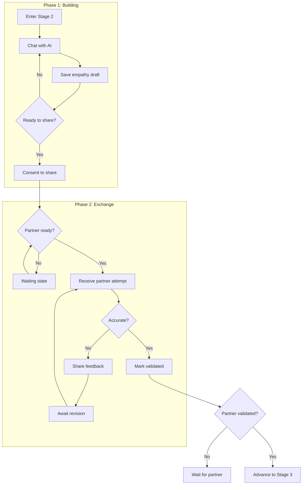

# Stage 2 API: Perspective Stretch

Endpoints for building and exchanging empathy attempts.

## Overview

Stage 2 has two phases:

1. **Phase 1: Building** - User works with AI to build their empathy guess about partner
2. **Phase 2: Exchange** - Users exchange empathy attempts and validate each other

### Data persistence
- Drafts -> `EmpathyDraft` (one per user/session)
- Consented share -> `EmpathyAttempt` (immutable) with `ConsentRecord.targetType = EMPATHY_ATTEMPT`
- Validation -> `EmpathyValidation` (one per recipient per attempt)

### Consent semantics (MVP)
- Consent request created when user hits `/empathy/consent`; decision stored on `ConsentRecord` (decision nullable until act).
- Revocation on `/consent/revoke` must set `ConsentRecord.decision = REVOKED`, `consentedContent.consentActive = false`, and mark dependent SharedVessel copies as inaccessible.
- Pending queue (`/consent/pending`) reads `ConsentRecord` rows with `decision IS NULL`.

---

## Phase 1: Building Empathy

### Save Empathy Draft

Save or update the user's empathy attempt draft.

```
POST /api/v1/sessions/:id/empathy/draft
```

### Request Body

```typescript
interface SaveEmpathyDraftRequest {
  content: string;  // The empathy attempt text
  readyToShare?: boolean; // Optional toggle to mark draft as ready (sets gate empathyDraftReady)
}
```

### Response

```typescript
interface SaveEmpathyDraftResponse {
  draft: EmpathyDraftDTO;
  readyToShare: boolean;  // AI assessment if draft shows genuine curiosity
}

interface EmpathyDraftDTO {
  id: string;
  content: string;
  version: number;
  readyToShare: boolean;
  updatedAt: string;
}
```

Validation: 1-1200 chars; trims whitespace; idempotent update (same draft row per user/session).

### Example

```bash
curl -X POST /api/v1/sessions/sess_abc123/empathy/draft \
  -H "Authorization: Bearer <token>" \
  -d '{
    "content": "I think they might be feeling overwhelmed and scared that our relationship is falling apart. Maybe they feel like nothing they do is good enough."
  }'
```

```json
{
  "success": true,
  "data": {
    "draft": {
      "id": "draft_001",
      "content": "I think they might be feeling overwhelmed and scared...",
      "updatedAt": "2024-01-16T17:00:00Z",
      "version": 1
    },
    "readyToShare": true
  }
}
```

---

### Get Empathy Draft

Get the current empathy draft.

```
GET /api/v1/sessions/:id/empathy/draft
```

### Response

```typescript
interface GetEmpathyDraftResponse {
  draft: EmpathyDraftDTO | null;
  canConsent: boolean;
  alreadyConsented: boolean;
}
```

---

### Consent to Share Empathy

Consent to share the empathy attempt with partner.

```
POST /api/v1/sessions/:id/empathy/consent
```

### Request Body

```typescript
interface ConsentToShareEmpathyRequest {
  draftId: string;
  // Optional: user can edit before sharing
  finalContent?: string;
}
```

### Response

```typescript
interface ConsentToShareEmpathyResponse {
  consented: boolean;
  consentedAt: string;
  waitingForPartner: boolean;

  // If partner already consented, their attempt is returned
  partnerAttempt?: EmpathyAttemptDTO;
}

interface EmpathyAttemptDTO {
  id: string;
  sourceUserId: string;
  content: string;
  sharedAt: string;
  consentRecordId: string;
}
```

### Side Effects

1. Draft becomes immutable (no more edits)
2. ConsentRecord created
3. Content moved to SharedVessel (as ConsentedContent)
4. If partner already consented, both receive each other's attempts
5. Partner notified via Ably

---

## Phase 2: Exchange

### Get Partner's Empathy Attempt

Get the partner's empathy attempt (after both have consented).

```
GET /api/v1/sessions/:id/empathy/partner
```

### Response

```typescript
interface GetPartnerEmpathyResponse {
  // Null if partner hasn't consented yet
  attempt: EmpathyAttemptDTO | null;
  waitingForPartner: boolean;

  // If validated, show validation status
  validated: boolean;
  validatedAt: string | null;
  awaitingRevision: boolean;
}

interface EmpathyAttemptDTO {
  id: string;
  sourceUserId: string;
  content: string;  // Partner's attempt to understand you
  sharedAt: string;
  consentRecordId: string;
}
```

### Errors

| Code | When |
|------|------|
| `CONSENT_REQUIRED` | Current user hasn't consented to share yet |
| `PARTNER_NOT_READY` | Partner hasn't consented to share yet |

---

### Validate Partner's Attempt

Provide feedback on how accurate partner's attempt is.

```
POST /api/v1/sessions/:id/empathy/validate
```

### Request Body

```typescript
interface ValidateEmpathyRequest {
  validated: boolean;  // true = "feels accurate", false = "needs refinement"
  feedback?: string;   // If not validated, what's missing
  consentToShareFeedback?: boolean;  // Allow feedback to be shared with partner
}
```

### Response

```typescript
interface ValidateEmpathyResponse {
  validated: boolean;
  validatedAt: string | null;

  // If feedback shared, partner can revise
  feedbackShared: boolean;
  awaitingRevision: boolean;

  // Gate status
  canAdvance: boolean;
  partnerValidated: boolean;
}
```

Validation: feedback max 1000 chars; one validation per recipient per attempt (idempotent overwrite allowed).

### Gate keys set by Stage 2 endpoints
- `empathyDraftReady`: set when `readyToShare` true on draft save
- `empathyConsented`: set when user consents to share their attempt
- `partnerConsented`: set when partner attempt becomes available
- `partnerValidated`: set when recipient posts `validated=true`

### Example: Validation with Feedback

```bash
curl -X POST /api/v1/sessions/sess_abc123/empathy/validate \
  -H "Authorization: Bearer <token>" \
  -d '{
    "validated": false,
    "feedback": "Close, but it is not so much fear as exhaustion. I feel like I have been carrying everything alone.",
    "consentToShareFeedback": true
  }'
```

```json
{
  "success": true,
  "data": {
    "validated": false,
    "validatedAt": null,
    "feedbackShared": true,
    "awaitingRevision": true,
    "canAdvance": false,
    "partnerValidated": false
  }
}
```

### Revision Loop

If feedback is shared:
1. Partner receives notification with feedback
2. Partner can revise their empathy attempt
3. User receives revised attempt
4. User can validate again

---

## Stage 2 Gate Requirements

To advance from Stage 2 to Stage 3:

| Gate | Requirement |
|------|-------------|
| `empathyAttemptCreated` | User has created an empathy attempt |
| `empathyAttemptConsentedToShare` | User consented to share it |
| `receivedPartnerAttempt` | Partner has shared their attempt |
| `validatedPartnerAttempt` | User validated partner's attempt as accurate |

**Note**: Both users must complete validation for either to advance.

---

## Stage 2 Flow



---

## Retrieval Contract

In Stage 2, the API enforces these retrieval rules:

| Allowed | Forbidden |
|---------|-----------|
| User's own data (all) | Partner's raw venting (User Vessel) |
| Shared Vessel (consented content only) | AI Synthesis Map directly |
| Partner's consented reflections | Non-consented partner data |

See [Retrieval Contracts: Stage 2](../state-machine/retrieval-contracts.md#stage-2-perspective-stretch).

---

## Related Documentation

- [Stage 2: Perspective Stretch](../../stages/stage-2-perspective-stretch.md) - Full stage documentation
- [Consensual Bridge](../../mechanisms/consensual-bridge.md) - Consent mechanism
- [Mirror Intervention](../../mechanisms/mirror-intervention.md) - Handling judgment
- [Consent API](./consent.md) - General consent endpoints

---

[Back to API Index](./index.md) | [Back to Backend](../index.md)
