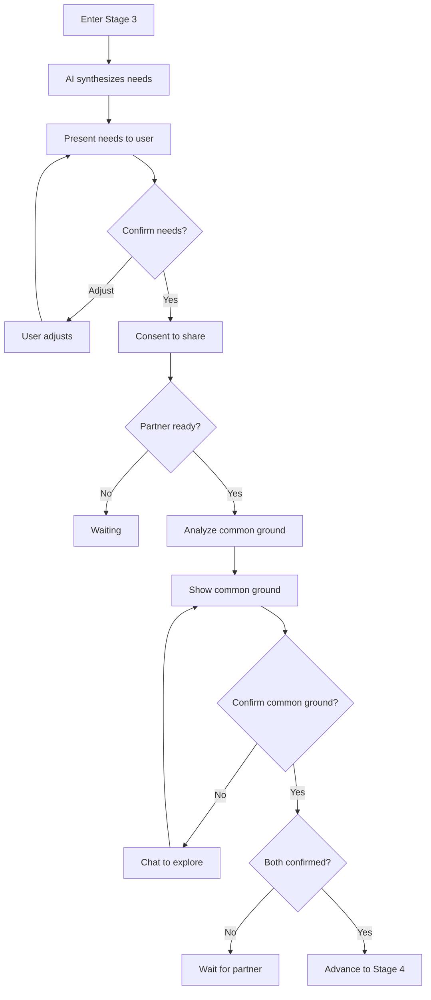

# Stage 3 API: Need Mapping

Endpoints for identifying needs, confirming them, and discovering common ground.

## Overview

Stage 3 transforms complaints and emotions into universal human needs, then identifies where both parties' needs overlap.

Key concepts:
- **Need synthesis**: AI extracts needs from Stage 1-2 content
- **Need confirmation**: User validates extracted needs
- **Common ground**: Needs shared by both parties

---

## Get Synthesized Needs

Get AI-synthesized needs for the current user based on their Stage 1-2 content.

```
GET /api/v1/sessions/:id/needs
```

### Response

```typescript
interface GetNeedsResponse {
  needs: IdentifiedNeedDTO[];
  synthesizedAt: string;
  isDirty: boolean;  // True if content changed since synthesis
}

interface IdentifiedNeedDTO {
  id: string;
  need: string;              // e.g., "Recognition"
  category: NeedCategory;    // SAFETY, CONNECTION, etc.
  description: string;       // Specific description
  evidence: string[];        // Quotes/references supporting this
  confirmed: boolean;
  aiConfidence: number;      // 0-1
}

enum NeedCategory {
  SAFETY = 'SAFETY',
  CONNECTION = 'CONNECTION',
  AUTONOMY = 'AUTONOMY',
  RECOGNITION = 'RECOGNITION',
  MEANING = 'MEANING',
  FAIRNESS = 'FAIRNESS',
}
```

### Example Response

```json
{
  "success": true,
  "data": {
    "needs": [
      {
        "id": "need_001",
        "need": "Recognition",
        "category": "RECOGNITION",
        "description": "Need to feel seen and appreciated for contributions at home",
        "evidence": [
          "I cleaned the whole house and they did not even notice",
          "I feel like nothing I do is ever enough"
        ],
        "confirmed": false,
        "aiConfidence": 0.87
      },
      {
        "id": "need_002",
        "need": "Partnership",
        "category": "FAIRNESS",
        "description": "Need for shared responsibility in household tasks",
        "evidence": [
          "I am always the one who has to think about everything"
        ],
        "confirmed": false,
        "aiConfidence": 0.72
      }
    ],
    "synthesizedAt": "2024-01-16T18:00:00Z",
    "isDirty": false
  }
}
```

### Synthesis Trigger

Synthesis is regenerated when:
- User enters Stage 3 (initial)
- `isDirty` is true and needs are requested
- User explicitly requests resynthesis

Validation: needs array size 2-8; each need has evidence 1-5 items; aiConfidence 0-1. `isDirty` derived from StageProgress.isSynthesisDirty.

---

## Confirm Needs

Confirm or adjust AI-synthesized needs.

```
POST /api/v1/sessions/:id/needs/confirm
```

### Request Body

```typescript
interface ConfirmNeedsRequest {
  confirmations: NeedConfirmation[];
}

interface NeedConfirmation {
  needId: string;
  confirmed: boolean;
  adjustment?: string;  // If user wants to rephrase
}
```

### Response

```typescript
interface ConfirmNeedsResponse {
  updated: IdentifiedNeedDTO[];
  allConfirmed: boolean;
  canProceedToCommonGround: boolean; // true when at least one confirmed AND consent flow ready
}
```

Validation: confirmation required for each presented need; adjustment max 300 chars. Sets gate `needsConfirmed` for caller. If partner confirmed their needs, sets `partnerNeedsConfirmed` derived flag.

### Example

```bash
curl -X POST /api/v1/sessions/sess_abc123/needs/confirm \
  -H "Authorization: Bearer <token>" \
  -d '{
    "confirmations": [
      {"needId": "need_001", "confirmed": true},
      {"needId": "need_002", "confirmed": true, "adjustment": "Need for us to be a team at home"}
    ]
  }'
```

---

## Add Custom Need

Add a need that AI did not identify.

```
POST /api/v1/sessions/:id/needs
```

### Request Body

```typescript
interface AddNeedRequest {
  need: string;
  category: NeedCategory;
  description: string;
}
```

### Response

```typescript
interface AddNeedResponse {
  need: IdentifiedNeedDTO;
}
```

Validation: need/description 1-200 chars; category required; creates IdentifiedNeed with `confirmed=false` and sets `isSynthesisDirty=false` for added item.

---

## Consent to Share Needs

Consent to share confirmed needs with partner.

```
POST /api/v1/sessions/:id/needs/consent
```

### Request Body

```typescript
interface ConsentShareNeedsRequest {
  needIds: string[];  // Which needs to share
}
```

### Response

```typescript
interface ConsentShareNeedsResponse {
  consented: boolean;
  sharedAt: string;
  waitingForPartner: boolean;

  // If partner already consented, common ground analysis begins
  commonGroundReady: boolean;
}
```

### Side Effects

1. Selected needs transformed and added to SharedVessel
2. Partner notified
3. If both consented, common ground analysis triggered
4. Creates `ConsentRecord` rows with `targetType = IDENTIFIED_NEED`, links ConsentedContent

Validation: needIds must be confirmed needs; at least 1. Sets gate `needsConfirmed` already true; partner’s consent sets `partnerNeedsConfirmed`.

---

## Get Common Ground

Get identified common ground between both parties.

```
GET /api/v1/sessions/:id/common-ground
```

### Response

```typescript
interface GetCommonGroundResponse {
  commonGround: CommonGroundDTO[];
  analysisComplete: boolean;
  bothConfirmed: boolean;
}

interface CommonGroundDTO {
  id: string;
  need: string;
  category: NeedCategory;
  description: string;        // How this need manifests for both
  confirmedByMe: boolean;
  confirmedByPartner: boolean;
  confirmedAt: string | null;
}
```

### Example Response

```json
{
  "success": true,
  "data": {
    "commonGround": [
      {
        "id": "cg_001",
        "need": "Safety",
        "category": "SAFETY",
        "description": "Both of you need to feel secure in the relationship and know it will last",
        "confirmedByMe": true,
        "confirmedByPartner": false,
        "confirmedAt": null
      },
      {
        "id": "cg_002",
        "need": "Connection",
        "category": "CONNECTION",
        "description": "Both of you want to feel close and connected to each other",
        "confirmedByMe": false,
        "confirmedByPartner": false,
        "confirmedAt": null
      }
    ],
    "analysisComplete": true,
    "bothConfirmed": false
  }
}
```

### Analysis Logic

Common ground is identified when:
- Both users share needs in the same category
- Deeper analysis finds connected needs (e.g., "recognition" and "appreciation")
- AI detects underlying shared needs beneath surface differences

Validation: commonGround array size 1-5; description 1-200 chars. Only needs with active consent participate.

---

## Confirm Common Ground

Confirm common ground items.

```
POST /api/v1/sessions/:id/common-ground/confirm
```

### Request Body

```typescript
interface ConfirmCommonGroundRequest {
  confirmations: {
    commonGroundId: string;
    confirmed: boolean;
  }[];
}
```

### Response

```typescript
interface ConfirmCommonGroundResponse {
  updated: CommonGroundDTO[];
  allConfirmedByMe: boolean;
  allConfirmedByBoth: boolean;
  canAdvance: boolean;
}
```

Validation: confirmations must reference items in current commonGround list; setting allConfirmedByMe true sets gate `commonGroundConfirmed` when partner also confirms.

---

## Stage 3 Gate Requirements

To advance from Stage 3 to Stage 4:

| Gate | Requirement |
|------|-------------|
| `needsConfirmed` | User confirmed at least one need |
| `partnerNeedsConfirmed` | Partner confirmed their needs |
| `commonGroundConfirmed` | Both confirmed at least one common ground |

**Both** users must confirm common ground before either can advance. Consent to share needs is required to generate common ground.

---

## Stage 3 Flow



---

## Retrieval Contract

In Stage 3, the API enforces these retrieval rules:

| Allowed | Forbidden |
|---------|-----------|
| User's identified needs | Partner's raw events |
| Shared Vessel (consented needs) | Non-consented partner needs |
| Common ground candidates | Partner's UserVessel |

Vector search is scoped to needs only (not raw events).

See [Retrieval Contracts: Stage 3](../state-machine/retrieval-contracts.md#stage-3-need-mapping).

---

## Related Documentation

- [Stage 3: Need Mapping](../../stages/stage-3-need-mapping.md)
- [Need Extraction Prompt](../prompts/need-extraction.md)
- [Universal Needs Framework](../../stages/stage-3-need-mapping.md#universal-needs-framework)

---

[Back to API Index](./index.md) | [Back to Backend](../index.md)
