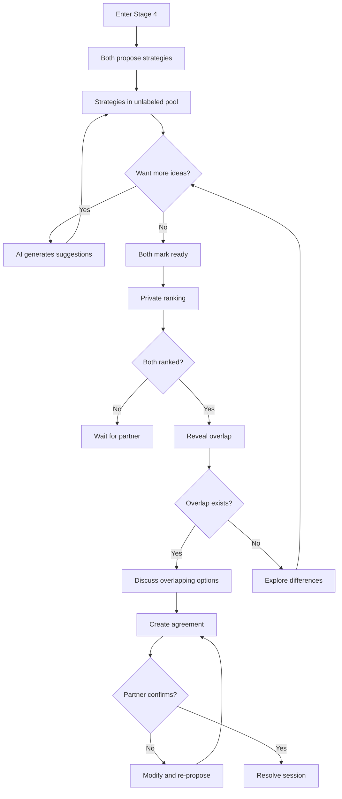

# Stage 4 API: Strategic Repair

Endpoints for collaborative strategy generation, ranking, and agreement documentation.

## Overview

Stage 4 is **sequential** (unlike stages 1-3 which are parallel). Both users must complete Stage 3 before either can enter Stage 4.

Key design:
- Both users propose strategies independently
- Strategies are presented as an **unlabeled pool**
- Users **privately rank** their preferences
- Overlap is revealed together

### Data persistence
- Strategies -> `StrategyProposal` (source tracked for audit; not exposed to partner)
- Rankings -> `StrategyRanking` (ordered array of proposal ids)
- Winning micro-experiment -> `Agreement` with `type = MICRO_EXPERIMENT` and `proposalId` reference
- Consent: if proposals are derived from partner content, create `ConsentRecord.targetType = STRATEGY_PROPOSAL`

### Data persistence
- Strategies -> `StrategyProposal` (source tracked for audit; not exposed to partner)
- Rankings -> `StrategyRanking` (ordered array of proposal ids)
- Winning micro-experiment -> `Agreement` with `type = MICRO_EXPERIMENT` and `proposalId` reference
- Consent: if proposals are derived from partner content, create `ConsentRecord.targetType = STRATEGY_PROPOSAL`

---

## Get Strategy Pool

Get all proposed strategies (unlabeled).

```
GET /api/v1/sessions/:id/strategies
```

### Response

```typescript
interface GetStrategiesResponse {
  strategies: StrategyDTO[];
  aiSuggestionsAvailable: boolean;
  phase: StrategyPhase;
}

interface StrategyDTO {
  id: string;
  description: string;
  needsAddressed: string[];      // Which common ground needs
  duration: string | null;       // e.g., "1 week"
  measureOfSuccess: string | null;
  // Note: NO source attribution
}

enum StrategyPhase {
  COLLECTING = 'COLLECTING',     // Users still adding
  RANKING = 'RANKING',           // Both ready to rank
  REVEALING = 'REVEALING',       // Revealing overlap
  NEGOTIATING = 'NEGOTIATING',   // Working toward agreement
  AGREED = 'AGREED',             // Agreement reached
}
```

### Example Response

```json
{
  "success": true,
  "data": {
    "strategies": [
      {
        "id": "strat_001",
        "description": "Have a 10-minute phone-free conversation at dinner for 5 days",
        "needsAddressed": ["Connection"],
        "duration": "5 days",
        "measureOfSuccess": "Did we do it? How did it feel?"
      },
      {
        "id": "strat_002",
        "description": "Say one specific thing I appreciate each morning for a week",
        "needsAddressed": ["Recognition"],
        "duration": "1 week",
        "measureOfSuccess": "Did we remember? Did it feel genuine?"
      },
      {
        "id": "strat_003",
        "description": "Use a pause signal when conversations get heated",
        "needsAddressed": ["Safety"],
        "duration": "Ongoing",
        "measureOfSuccess": "Did we use it? Did it help?"
      }
    ],
    "aiSuggestionsAvailable": true,
    "phase": "COLLECTING"
  }
}
```

**Privacy note**: Strategies are never attributed to their source. Both parties see the same unlabeled list.

Validation: description required (1-800 chars), needsAddressed max 3 entries, duration/measureOfSuccess optional. Allow duplicates; UI may dedupe.

---

## Propose Strategy

Add a new strategy to the pool.

```
POST /api/v1/sessions/:id/strategies
```

### Request Body

```typescript
interface ProposeStrategyRequest {
  description: string;
  needsAddressed?: string[];
  duration?: string;
  measureOfSuccess?: string;
}
```

### Response

```typescript
interface ProposeStrategyResponse {
  strategy: StrategyDTO;
  totalStrategies: number;
}
```

### AI Refinement

After submission, AI may suggest refinements:

```typescript
interface StrategyRefinementSuggestion {
  original: string;
  refined: string;
  reason: string;  // e.g., "Made more specific and time-bounded"
}
```

---

## Request AI Suggestions

Request AI-generated strategy suggestions.

```
POST /api/v1/sessions/:id/strategies/suggest
```

### Request Body

```typescript
interface RequestSuggestionsRequest {
  count?: number;  // Default: 3
  focusNeeds?: string[];  // Which needs to focus on
}
```

### Response

```typescript
interface RequestSuggestionsResponse {
  suggestions: StrategyDTO[];
  source: 'AI_GENERATED';
}
```

### Source Constraints

AI suggestions are generated from:
- Common ground needs (Shared Vessel)
- Global Micro-Experiments Library (anonymized)

**Never** from user memory (Retrieval Contract enforced).

Validation: count 1-5; focusNeeds max 3 entries. Suggestions persisted as `StrategyProposal` with `source = AI_SUGGESTED`.

---

## Mark Ready to Rank

Indicate readiness to move to ranking phase.

```
POST /api/v1/sessions/:id/strategies/ready
```

### Response

```typescript
interface MarkReadyResponse {
  ready: boolean;
  partnerReady: boolean;
  canStartRanking: boolean;
}
```

### Side Effects

When both ready:
- Phase changes to `RANKING`
- Strategy pool is locked (no new additions)
- Partner notified

Gate link: sets `strategiesSubmitted` for caller when they mark ready.

---

## Submit Ranking

Submit private ranking of strategies.

```
POST /api/v1/sessions/:id/strategies/rank
```

### Request Body

```typescript
interface SubmitRankingRequest {
  rankedIds: string[]; // Ordered strategy IDs (unique, length >= 1)
}
```

### Response

```typescript
interface SubmitRankingResponse {
  submitted: boolean;
  submittedAt: string;
  partnerSubmitted: boolean;
  awaitingReveal: boolean;
}
```

### Privacy

Rankings are **completely private** until both submit. Neither party can see the other's choices during ranking.

Validation: IDs must exist in session, no duplicates, overwrite allowed (last write wins). Gate link: sets `rankingsSubmitted` for caller.

---

## Reveal Overlap

Reveal overlapping rankings once both users have submitted.

```
GET /api/v1/sessions/:id/strategies/overlap
```

### Response

```typescript
interface RevealOverlapResponse {
  overlap: StrategyDTO[];
  phase: StrategyPhase; // Should be REVEALING or later
}
```

### Behavior

- If overlap exists: return shared highest-ranked items
- If no overlap: return empty array and set `phase = NEGOTIATING`

Gate link: sets `overlapIdentified` when overlap is computed (even if empty).

---

## Create Agreement

Formalize agreement on a micro-experiment.

```
POST /api/v1/sessions/:id/agreements
```

### Request Body

```typescript
interface CreateAgreementRequest {
  strategyId?: string;            // From existing strategy
  description: string;            // Final agreed description (can refine strategy text)
  type: 'MICRO_EXPERIMENT' | 'COMMITMENT' | 'CHECK_IN';
  duration?: string;
  measureOfSuccess?: string;
  followUpDate?: string;          // ISO 8601
}
```

### Response

```typescript
interface CreateAgreementResponse {
  agreement: AgreementDTO;
  awaitingPartnerConfirmation: boolean;
}

interface AgreementDTO {
  id: string;
  description: string;
  duration: string | null;
  measureOfSuccess: string | null;
  status: AgreementStatus;
  agreedByMe: boolean;
  agreedByPartner: boolean;
  agreedAt: string | null;
  followUpDate: string | null;
}

enum AgreementStatus {
  PROPOSED = 'PROPOSED',
  AGREED = 'AGREED',
  IN_PROGRESS = 'IN_PROGRESS',
  COMPLETED = 'COMPLETED',
  ABANDONED = 'ABANDONED',
}
```

---

## Confirm Agreement

Confirm proposed agreement (partner response).

```
POST /api/v1/sessions/:id/agreements/:agreementId/confirm
```

### Request Body

```typescript
interface ConfirmAgreementRequest {
  confirmed: boolean;
  modification?: string;  // If suggesting change
}
```

### Response

```typescript
interface ConfirmAgreementResponse {
  agreement: AgreementDTO;
  sessionCanResolve: boolean;  // True if at least one agreement confirmed
}
```

---

## Resolve Session

Mark session as resolved after successful agreement.

```
POST /api/v1/sessions/:id/resolve
```

### Response

```typescript
interface ResolveSessionResponse {
  resolved: boolean;
  resolvedAt: string;
  agreements: AgreementDTO[];
  followUpScheduled: boolean;
}
```

### Side Effects

- Session status changes to `RESOLVED`
- Both parties notified
- If follow-up scheduled, reminder queued

---

## Stage 4 Gate Requirements

To resolve session:

| Gate | Requirement |
|------|-------------|
| `proposalsCreated` | At least one strategy in pool |
| `proposalsRanked` | Both users submitted rankings |
| `agreementReached` | At least one agreement confirmed by both |
| `followUpScheduled` | Optional: follow-up date set |

---

## Stage 4 Flow



---

## Retrieval Contract

In Stage 4, the API enforces these retrieval rules:

| Allowed | Forbidden |
|---------|-----------|
| All Shared Vessel content | User Vessel raw content |
| Confirmed common ground | Vector search on user memory |
| Past agreements | Any retrieval for decision-making |
| Global Library (vector) | - |

See [Retrieval Contracts: Stage 4](../state-machine/retrieval-contracts.md#stage-4-strategic-repair).

---

## Related Documentation

- [Stage 4: Strategic Repair](../../stages/stage-4-strategic-repair.md)
- [Stage 4 Prompt](../prompts/stage-4-repair.md)
- [Global Library](../data-model/prisma-schema.md#global-library-stage-4-suggestions)

---

[Back to API Index](./index.md) | [Back to Backend](../index.md)
