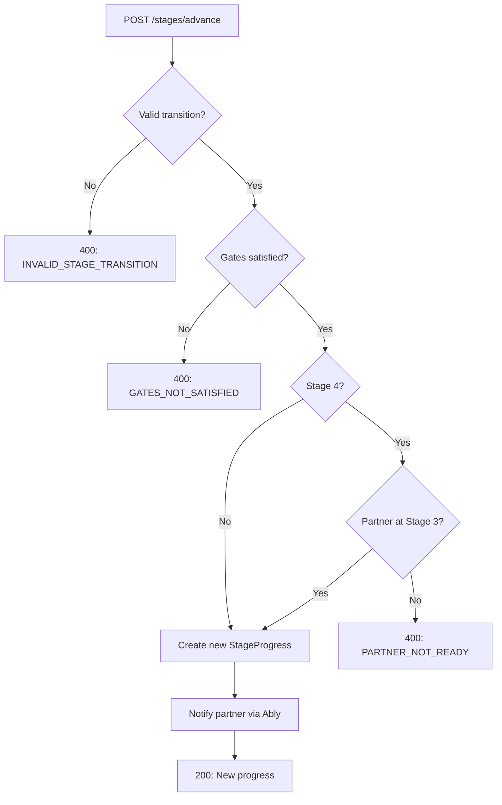

# Stages API

Stage progression and gate validation.

## Core Concept: No Session.currentStage

**Important**: There is no single "current stage" for a session. Each user progresses independently through stages 0-3. The API returns progress for both users separately.

See [Prisma Schema: Stage Tracking](../data-model/prisma-schema.md#stage-tracking-no-sessioncurrentstage) for rationale.

---

## Get Stage Progress

Get stage progress for both users in a session.

```
GET /api/v1/sessions/:id/progress
```

### Response

```typescript
interface GetProgressResponse {
  sessionId: string;
  myProgress: StageProgressDetailDTO;
  partnerProgress: PartnerStageStatusDTO;  // Limited info

  // Computed
  canAdvance: boolean;
  advanceBlockedReason?: StageBlockedReason;
}

interface StageProgressDetailDTO {
  stage: Stage;
  status: StageStatus;
  startedAt: string;
  completedAt: string | null;
  gates: GateSatisfactionDTO;
}

interface PartnerStageStatusDTO {
  stage: Stage;
  status: StageStatus;
  // Note: partner gate details are NOT exposed
}
```

### Example Response

```json
{
  "success": true,
  "data": {
    "sessionId": "sess_abc123",
    "myProgress": {
      "stage": 1,
      "status": "IN_PROGRESS",
      "startedAt": "2024-01-16T15:00:00Z",
      "completedAt": null,
      "gates": {
        "stage": 1,
        "feelHeardConfirmed": false,
        "feelHeardConfirmedAt": null,
        "finalEmotionalReading": null
      }
    },
    "partnerProgress": {
      "stage": 1,
      "status": "GATE_PENDING"
    },
    "canAdvance": false,
    "advanceBlockedReason": "GATES_NOT_SATISFIED"
  }
}
```

---

## Get Gate Status

Get detailed gate satisfaction status for a specific stage.

```
GET /api/v1/sessions/:id/stages/:stage/gates
```

### Path Parameters

| Param | Type | Description |
|-------|------|-------------|
| `id` | string | Session ID |
| `stage` | number | Stage number (0-4) |

### Response

Returns stage-specific gate structure. See Stage DTOs in `shared/src/dto/stage.ts` for all gate types.

### Stage 0 Gates

```typescript
interface Stage0Gates {
  stage: 0;
  compactSigned: boolean;
  compactSignedAt: string | null;
  partnerCompactSigned: boolean;
}
```

### Stage 1 Gates

```typescript
interface Stage1Gates {
  stage: 1;
  feelHeardConfirmed: boolean;
  feelHeardConfirmedAt: string | null;
  finalEmotionalReading: number | null;
}
```

### Stage 2 Gates

```typescript
interface Stage2Gates {
  stage: 2;
  empathyAttemptCreated: boolean;
  empathyAttemptConsentedToShare: boolean;
  receivedPartnerAttempt: boolean;
  validatedPartnerAttempt: boolean;
  validatedAt: string | null;
}
```

---

## Advance Stage

Request advancement to the next stage.

```
POST /api/v1/sessions/:id/stages/advance
```

### Request Body

```typescript
interface AdvanceStageRequest {
  fromStage: Stage;
  toStage: Stage;
}
```

### Validation

1. `toStage` must be `fromStage + 1` (no skipping)
2. User's current stage must match `fromStage`
3. All gates for `fromStage` must be satisfied
4. For stages 0-3: partner does NOT need to complete (parallel progression)
5. For stage 4: both users must be at stage 3 completed (sequential)

### Response

```typescript
interface AdvanceStageResponse {
  success: boolean;
  newProgress: StageProgressDetailDTO;
  blockedReason?: StageBlockedReason;
  unsatisfiedGates?: string[];
}
```

### Example: Successful Advance

```bash
curl -X POST /api/v1/sessions/sess_abc123/stages/advance \
  -H "Authorization: Bearer <token>" \
  -d '{"fromStage": 0, "toStage": 1}'
```

```json
{
  "success": true,
  "data": {
    "success": true,
    "newProgress": {
      "stage": 1,
      "status": "IN_PROGRESS",
      "startedAt": "2024-01-16T15:00:00Z",
      "completedAt": null,
      "gates": {
        "stage": 1,
        "feelHeardConfirmed": false,
        "feelHeardConfirmedAt": null,
        "finalEmotionalReading": null
      }
    }
  }
}
```

### Example: Blocked Advance

```json
{
  "success": true,
  "data": {
    "success": false,
    "newProgress": {
      "stage": 1,
      "status": "IN_PROGRESS",
      "startedAt": "2024-01-16T15:00:00Z",
      "completedAt": null,
      "gates": {
        "stage": 1,
        "feelHeardConfirmed": false,
        "feelHeardConfirmedAt": null,
        "finalEmotionalReading": null
      }
    },
    "blockedReason": "GATES_NOT_SATISFIED",
    "unsatisfiedGates": ["feelHeardConfirmed"]
  }
}
```

### Stage Blocked Reasons

| Reason | Description |
|--------|-------------|
| `GATES_NOT_SATISFIED` | User hasn't completed required actions |
| `PARTNER_NOT_READY` | Partner hasn't reached required stage (Stage 4 only) |
| `SESSION_NOT_ACTIVE` | Session is paused or ended |
| `INVALID_STAGE_TRANSITION` | Trying to skip stages or go backwards |

---

## Stage Advancement Flow



---

## Related Documentation

- [Stage 0: Onboarding](../../stages/stage-0-onboarding.md)
- [Stage 1: The Witness](../../stages/stage-1-witness.md)
- [Stage 2: Perspective Stretch](../../stages/stage-2-perspective-stretch.md)
- [Retrieval Contracts](../state-machine/retrieval-contracts.md) - Data access per stage

---

[Back to API Index](./index.md) | [Back to Backend](../index.md)
