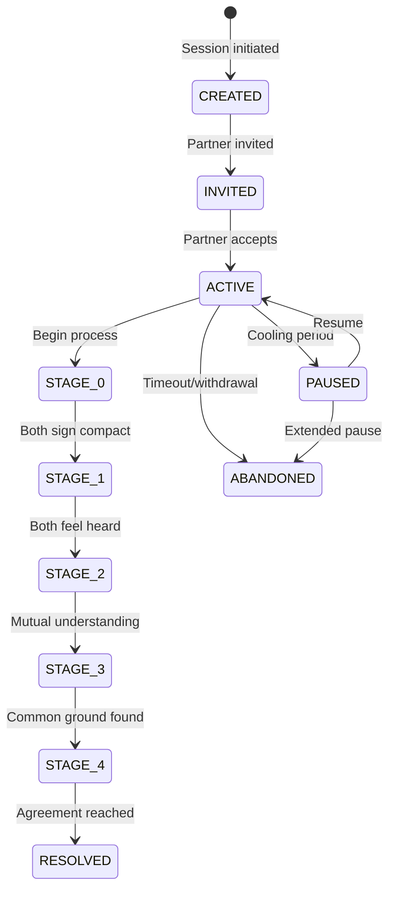

# State Machine

Session lifecycle management and stage-scoped data access rules.

## Documents

### Session States
Session lifecycle FSM with state transitions and required invariants

### Stage Gates
Advancement conditions linked to stage documentation (see below)

### [Retrieval Contracts](./retrieval-contracts.md)
**Critical** - Per-stage data access rules that enforce privacy

## Core Concept

The State Machine Layer enforces:

1. **Session Lifecycle**: Created → Active → Stages → Resolved
2. **Stage Progression**: Gate conditions that must be satisfied
3. **Data Access Rules**: What can be retrieved at each stage

## Key Principles

| Principle | Implementation |
|-----------|----------------|
| Parallel work in Stages 1-3 | Each user progresses independently |
| Sequential work in Stages 0 & 4 | Requires real-time coordination |
| Gate enforcement | No advancement until conditions met |
| Retrieval contracts | Hard rules on data access per stage |

## Session States (MVP requirements)

| State | Entry Condition | Exit Condition | Notes |
|-------|-----------------|----------------|-------|
| CREATED | Session created, invitation generated | Partner accepts invitation (→ INVITED) | No chat allowed |
| INVITED | Partner has link, not joined | Partner joins (→ ACTIVE) or expires | Sender can resend |
| ACTIVE | Both users present | Stage 4 resolve → RESOLVED; pause → PAUSED; timeout → ABANDONED | All stages run here |
| PAUSED | User-initiated cooling | Resume call → ACTIVE | No chat; can view history + emotions |
| WAITING | One user ahead at a gate | Partner catches up → ACTIVE | Derived from StageProgress |
| RESOLVED | Agreement recorded | N/A | Session locked, view-only |
| ABANDONED | Timeout/withdrawal | N/A | Can be archived |

## Stage Gates and `gatesSatisfied` keys

`StageProgress.gatesSatisfied` MUST use these keys per stage for consistency and testing:

| Stage | Gate Keys | Satisfied When |
|-------|-----------|----------------|
| 0 (Onboarding) | `compactSigned`, `partnerCompactSigned` | User signed, partner signed |
| 1 (Witness) | `feelHeardConfirmed` | User posts feel-heard true |
| 2 (Perspective) | `empathyDraftReady`, `empathyConsented`, `partnerConsented`, `partnerValidated` | Draft marked ready, user consents to share, partner consents, partner validates (or user accepts feedback path) |
| 3 (Need Mapping) | `needsConfirmed`, `partnerNeedsConfirmed`, `commonGroundConfirmed` | User confirms needs, partner confirms theirs, both confirm common ground |
| 4 (Strategic Repair) | `strategiesSubmitted`, `rankingsSubmitted`, `overlapIdentified`, `agreementCreated` | Both submitted strategies (or declared none), both rankings in, overlap revealed, Agreement saved |

Advancement rule: a user can advance when all gate keys for their current stage are true AND any stage-level preconditions (e.g., Stage 4 only after both Stage 3 complete). WAITING state is derived when one user satisfies gates and the other has not.

[Back to Backend](../index.md)
