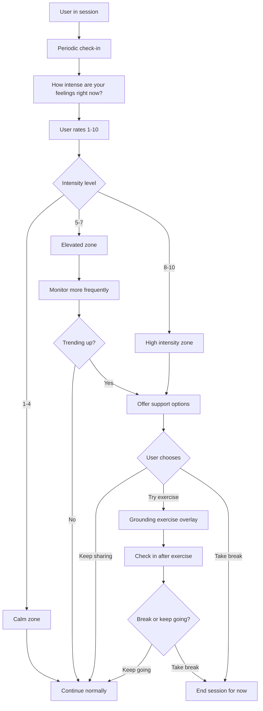
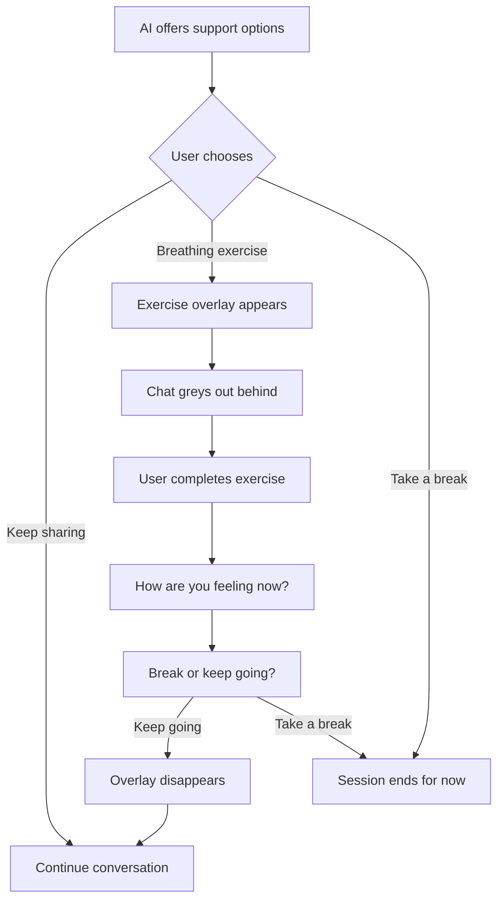
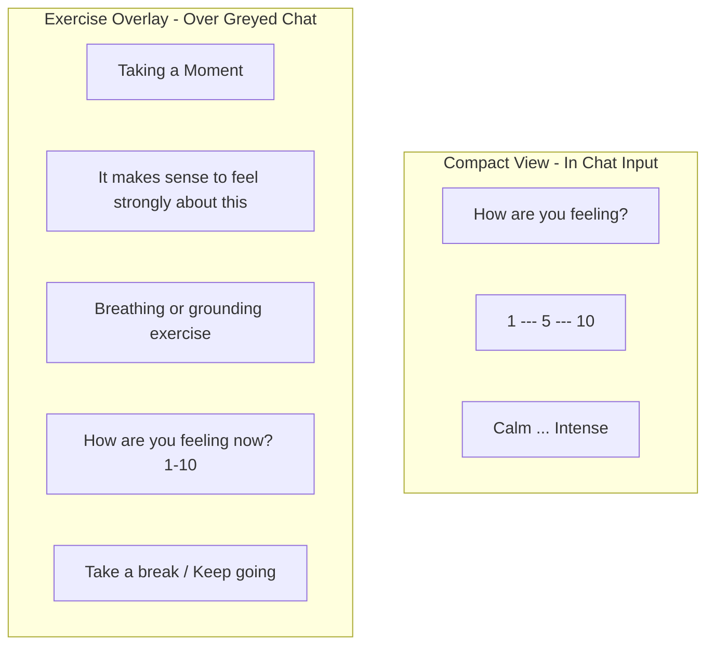
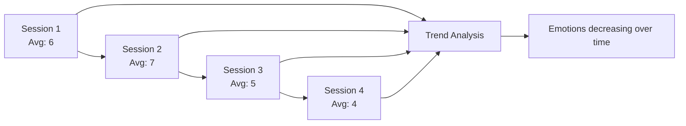

# Emotional Barometer

:::tip See it in action
<a href="/demo/features/cooling-period.html" onClick="window.location.href='/demo/features/cooling-period.html'; return false;">Try the Support Options demo</a> - See how the AI offers choices when emotions run high.

<a href="/demo/features/waiting-states.html" onClick="window.location.href='/demo/features/waiting-states.html'; return false;">Try the Waiting States demo</a> - See what users experience while waiting for their partner.
:::

## Purpose

Monitor emotional intensity throughout the process and offer support options when intensity is high. The approach is choice-based—users decide what helps them regulate, whether that's continuing to share (which can be cathartic) or trying a grounding exercise.

## How It Works



## Intensity Zones

| Rating | Zone | AI Behavior |
|--------|------|-------------|
| 1-4 | Calm | Normal pace; occasional check-ins |
| 5-7 | Elevated | More frequent check-ins; watch for trends |
| 8-10 | High | Offer support options; user chooses path |

## Offering Support

When intensity is high, the AI offers options conversationally:

```
AI: "I can feel how intense this is. A few paths from here—
     you can keep sharing if getting it out is helping,
     try a breathing exercise to settle your body,
     or take a break and come back later.
     What feels right?"
```

The user chooses. No advancement is disabled; no mandatory cooling period. Trust the user to know what they need.

## Support Options Flow

When the user chooses to try an exercise, it appears as an overlay:



Key points:
- Exercises navigate to a dedicated screen with easy "Back to chat" option
- Chat is preserved and restored when returning
- After exercise, user chooses next step—no gatekeeping
- "Keep sharing" is always a valid choice (writing can be cathartic)

## Wireframe: Emotional Barometer UI



## Multi-Session Persistence

The barometer tracks patterns over time:



## Privacy of Emotional Data

- Ratings are **private by default**
- Stored in User Vessel only
- AI may ask consent to share if it helps:

```
AI: "I noticed you have been feeling quite intense during our
    conversations. Would it be helpful for [Partner] to know
    that this process brings up strong feelings for you?"
```

## Support Options

When intensity is high, the AI offers:

| Option | Description |
|--------|-------------|
| Keep sharing | Continue the conversation—writing can be cathartic |
| Breathing exercise | Guided 4-7-8 breathing or similar |
| Grounding exercise | 5-4-3-2-1 senses check with required text input at each step |
| Body scan | Brief check-in with physical sensations |
| Take a break | End session and return later |

Note: "Private journaling" is no longer a separate option—the user is already in a text conversation, so "keep sharing" serves this purpose.

**Grounding exercise design:** Each step of the 5-4-3-2-1 grounding exercise requires the user to type their observations before proceeding (e.g., naming 5 things they can see). This ensures genuine engagement rather than clicking through. The input is not saved—the act of noticing and naming is what matters.

## Display Options

The barometer can be presented in two ways:

1. **Always visible** - A persistent slider at the bottom of the chat interface that users can adjust at any time
2. **Periodic popup** - The barometer appears as a gentle popup at key moments (stage transitions, after intense exchanges, or on a timer)

Either approach is valid. The always-visible option provides continuous awareness, while the popup approach can feel less intrusive and more intentional.

## Implementation Notes

- Check-ins should feel natural, not intrusive
- Frequency adapts to user pattern (more often if volatile)
- Never shame or judge high intensity ratings
- Support options are framed as choices, not requirements
- Trust users to know what helps them regulate
- Some people regulate by continuing to express—honor that
- Exercises navigate to a dedicated screen with easy back navigation
- Chat content is preserved and restored after exercises

---

## Related Documents

- [User Journey](../overview/user-journey.md)
- [Stage 1: The Witness](../stages/stage-1-witness.md)
- [System Guardrails](./guardrails.md)

---

[Back to Mechanisms](./index.md) | [Back to Plans](../index.md)
