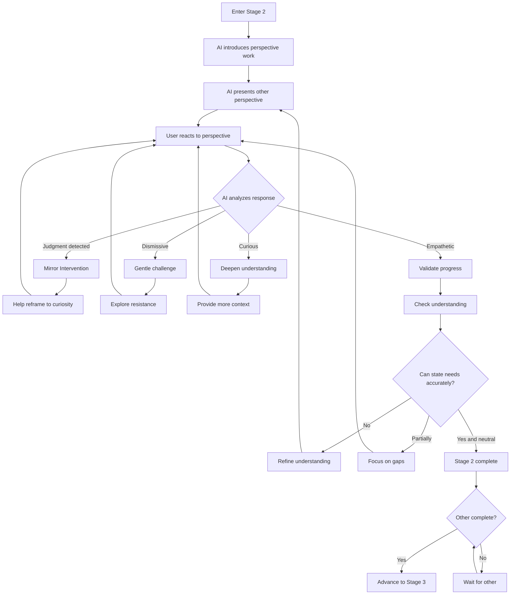
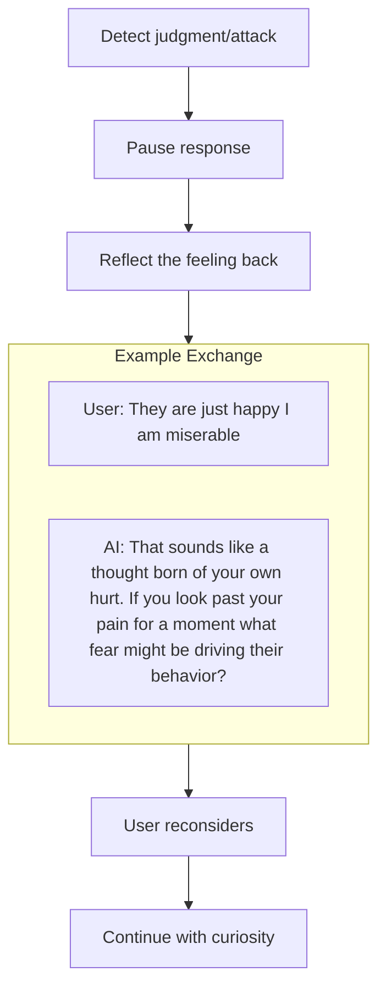
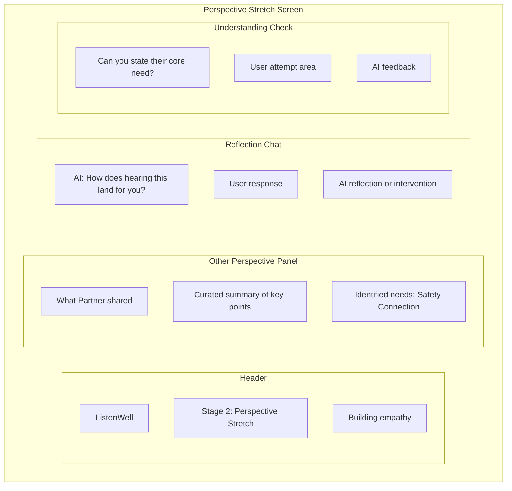

# Stage 2: Perspective Stretch

## Purpose

Build genuine empathy by helping each user understand the other persons perspective, needs, and experience.

## AI Goal

- Present the other persons perspective (curated, consented content only)
- Monitor for judgment, attacks, or dismissiveness
- Use Mirror Intervention when needed
- Confirm the user can accurately state the other persons needs without judgment

## Flow



## Mirror Intervention

When judgment or attack patterns are detected, the AI uses reflection to redirect:



See [Mirror Intervention](../mechanisms/mirror-intervention.md) for details.

## What Gets Shared

The AI curates what each user sees about the other:

| Shared | Not Shared |
|--------|------------|
| Core needs identified | Raw venting language |
| Key concerns | Accusations or attacks |
| Emotional impact summary | Detailed grievance lists |
| Consented specific content | Anything not explicitly approved |

The [Consensual Bridge](../mechanisms/consensual-bridge.md) mechanism controls this.

## Accuracy Check

The AI verifies understanding by asking the user to state the other persons needs:

```
AI: "Based on what we have discussed, can you describe what you
    think [Partner] needs most from this situation?"

User: [Attempts to articulate]

AI: [Evaluates for accuracy and judgment-free language]
```

**Pass criteria:**
- Identifies at least one genuine need
- States it without blame or sarcasm
- Shows some understanding of why that need matters to the other person

## Wireframe: Perspective Stretch Interface



## Success Criteria

User can accurately state the other persons needs without judgment.

## Failure Paths

| Scenario | AI Response |
|----------|-------------|
| Repeated judgment | Persistent Mirror Intervention; explore source of judgment |
| Complete dismissal | Acknowledge difficulty; return to Stage 1 if needed |
| Emotional escalation | Barometer triggers cooling period |
| User tries to skip | Explain gate requirement; offer support |

## Data Captured

- User reactions to other perspective
- Accuracy check attempts
- Mirror interventions used
- Progress toward empathy

---

## Related Documents

- [Previous: Stage 1 - The Witness](./stage-1-witness.md)
- [Next: Stage 3 - Need Mapping](./stage-3-need-mapping.md)
- [Mirror Intervention](../mechanisms/mirror-intervention.md)
- [Consensual Bridge](../mechanisms/consensual-bridge.md)

---

[Back to Stages](./index.md) | [Back to Plans](../index.md)
