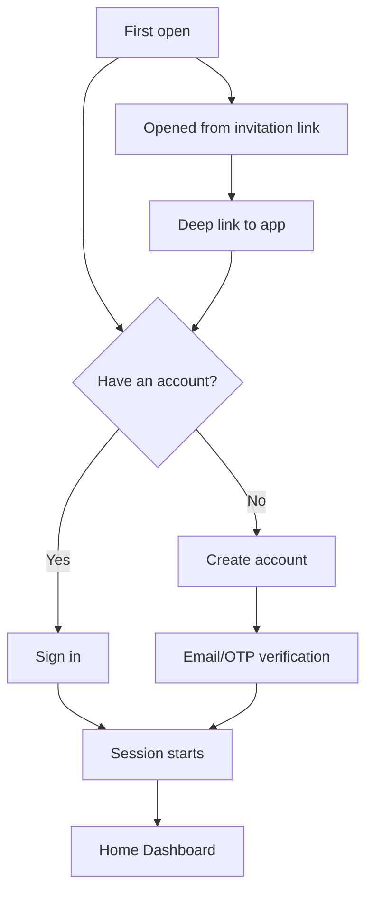
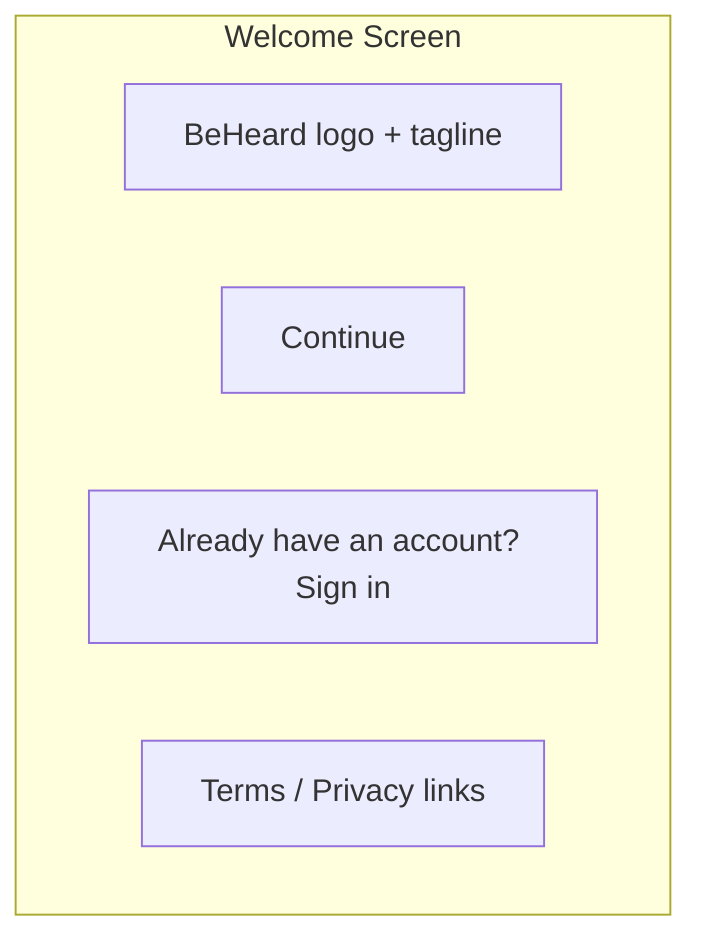
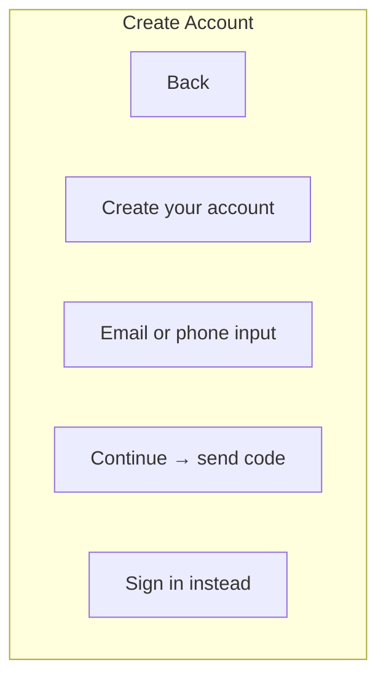
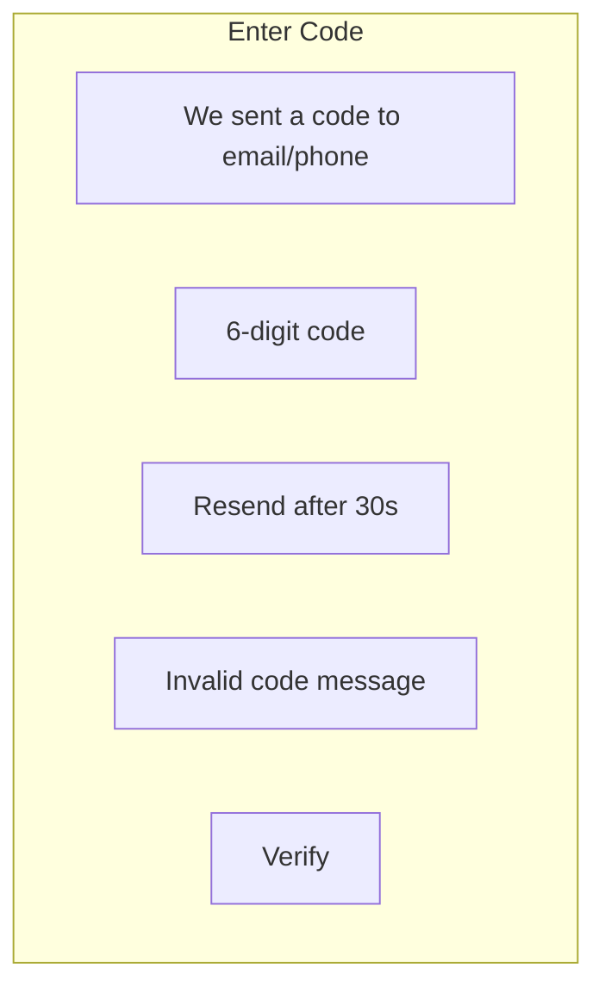
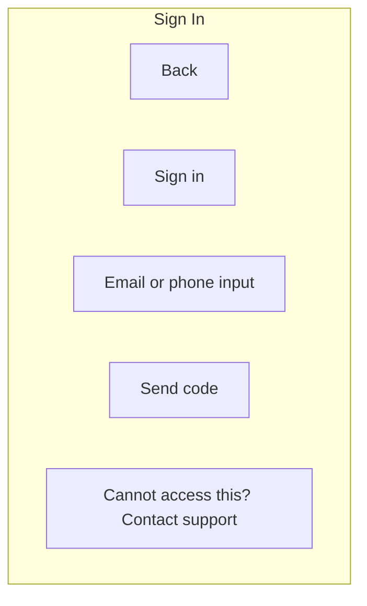
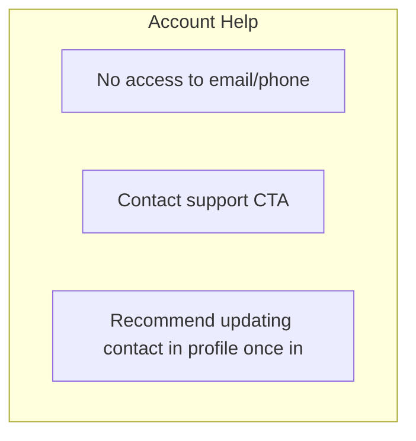
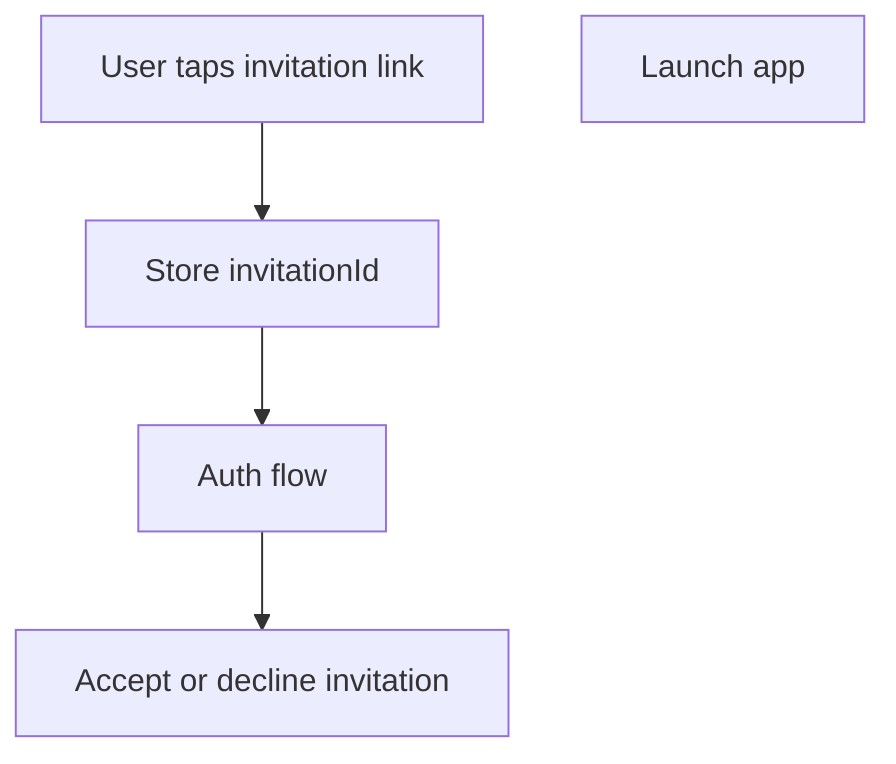

# Authentication & First-Run

Entry experiences for first open, creating an account, signing in, and recovery.

## Flows

## Screens

### First Open

### Create Account

### Verification (OTP)

### Sign In

### Account Recovery

## Invitation-Aware First Run

UX expectations:
- Preserve the invitation through auth and land the user on the Session Dashboard for that invite.
- If the invite expires mid-flow, show a friendly expired state with a “request new invite” CTA.

## Empty / Logged-Out States

| State | Message | CTA |
|-------|---------|-----|
| Logged out | You need to sign in to continue | Sign in / Create account |
| Session expired | Your session expired | Sign in again |
| Missing invite | We could not find that invitation | Return home / Contact support |

## Navigation Targets After Auth

- If launched from invite: `Session Dashboard` for the invitation, then Stage 0 compact.
- If no invite and no sessions: `Home Dashboard` in empty state.
- If existing sessions: `Home Dashboard` with hero card prioritizing the most urgent session.

---

[Back to Wireframes](./index.md) | [Back to Plans](../index.md)
