# Emotional Barometer UI

Interface components for tracking and responding to emotional intensity.

## Inline Check (Always Visible)

A minimal, always-present indicator in the input area:

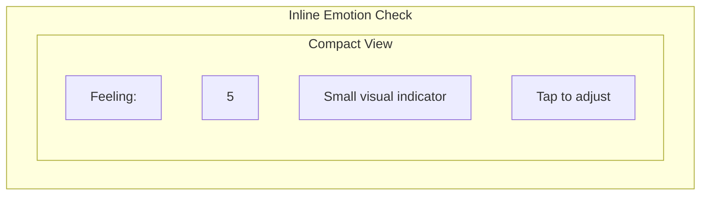

This appears in the input bar and can be tapped to expand.

## Expanded Slider

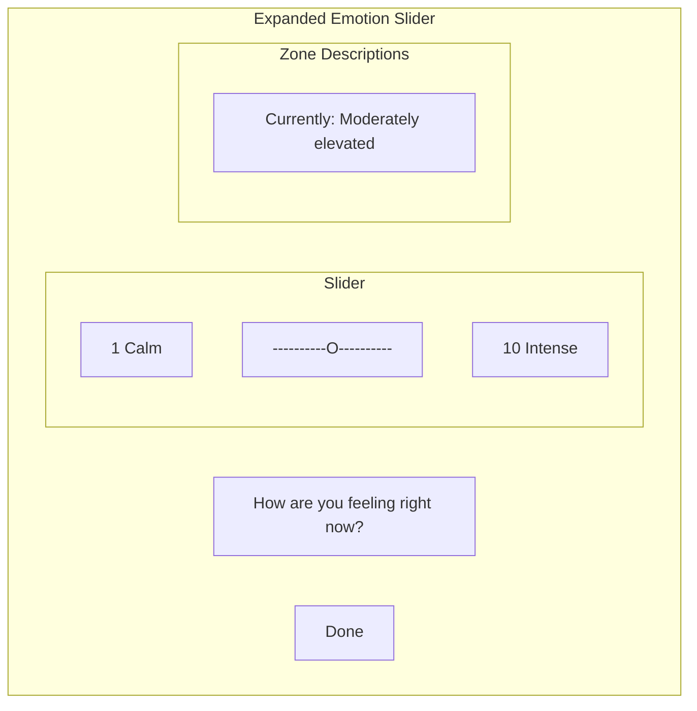

## Zone Styling

| Range | Color | Description |
|-------|-------|-------------|
| 1-4 | Calm blue/green | Calm and regulated |
| 5-7 | Warm yellow | Elevated but manageable |
| 8-10 | Soft coral | High intensity |

## Periodic Prompt

The AI occasionally prompts for an emotion check:

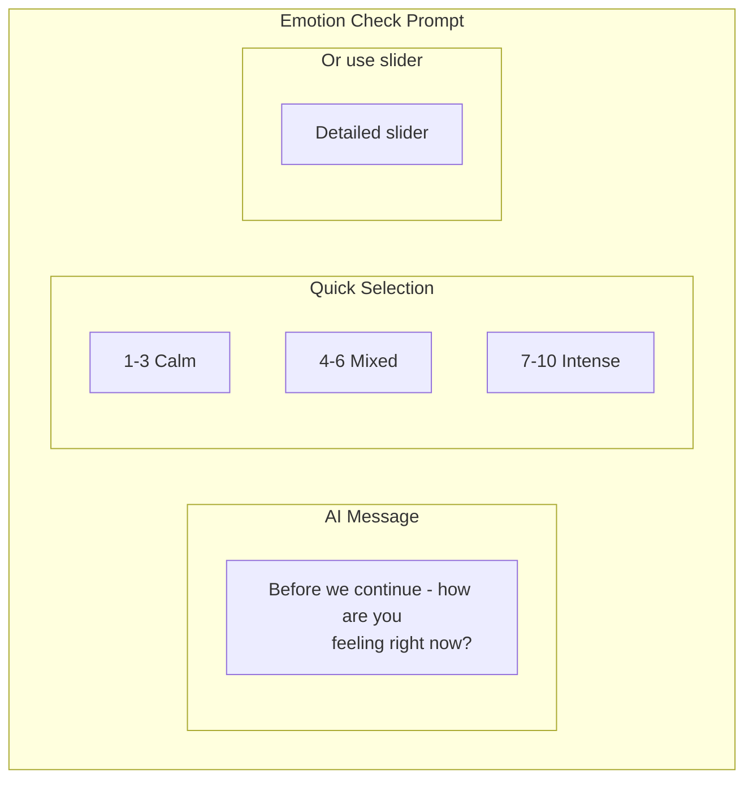

## Cooling Period Interface

When intensity exceeds threshold:

### Initial Trigger

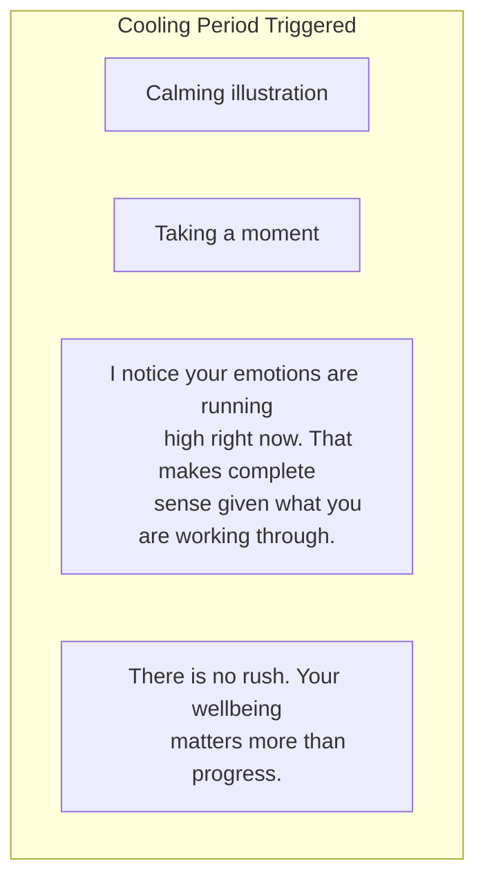

### Options Screen

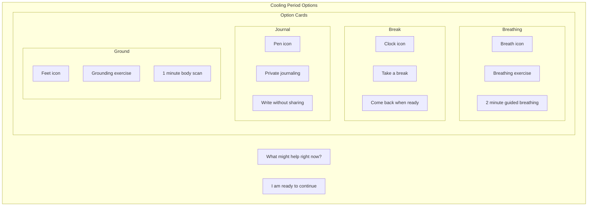

### Breathing Exercise Screen

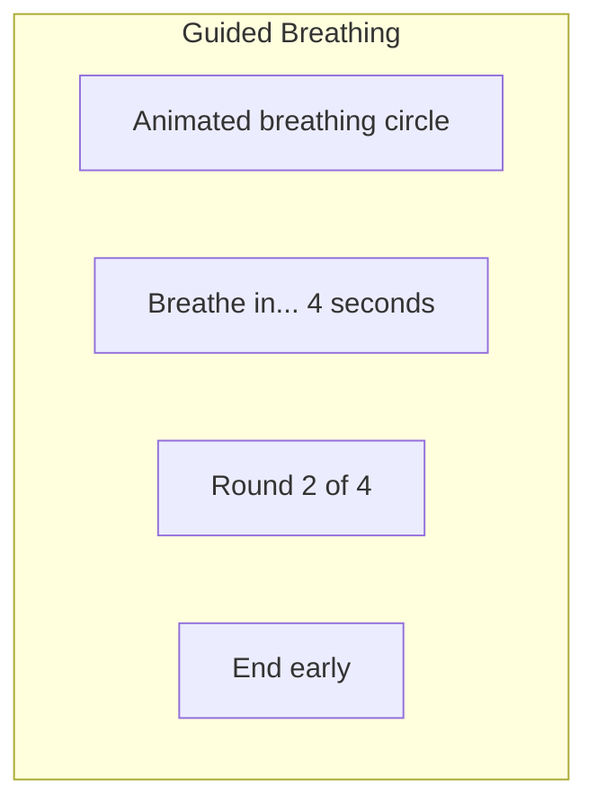

Animation sequence:
1. Circle expands: "Breathe in" (4 seconds)
2. Circle holds: "Hold" (7 seconds)
3. Circle contracts: "Breathe out" (8 seconds)
4. Repeat 4 times

### Return Check

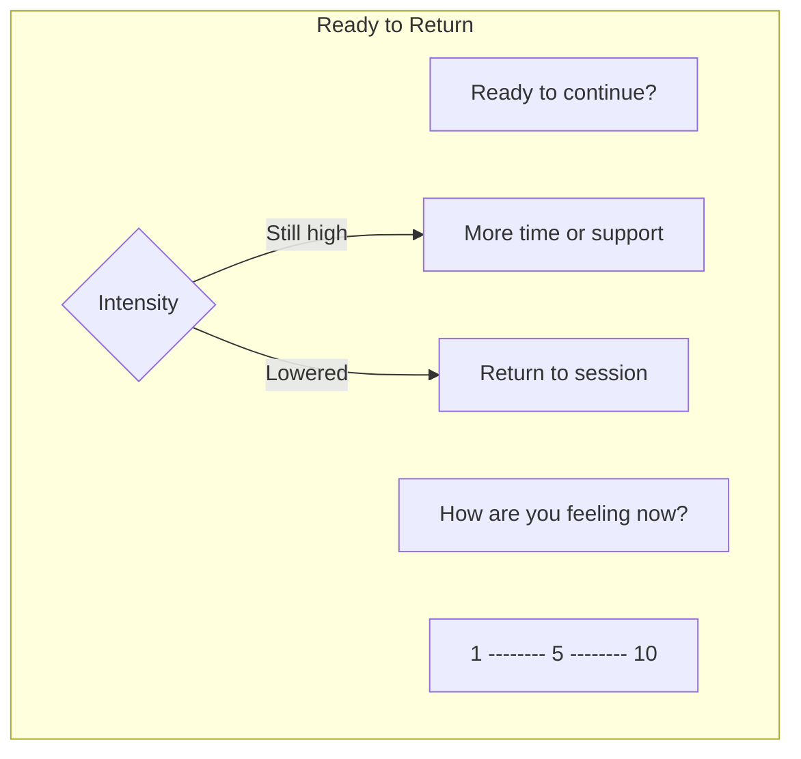

## Trend Visualization (Optional)

For multi-session users, show emotional trends:

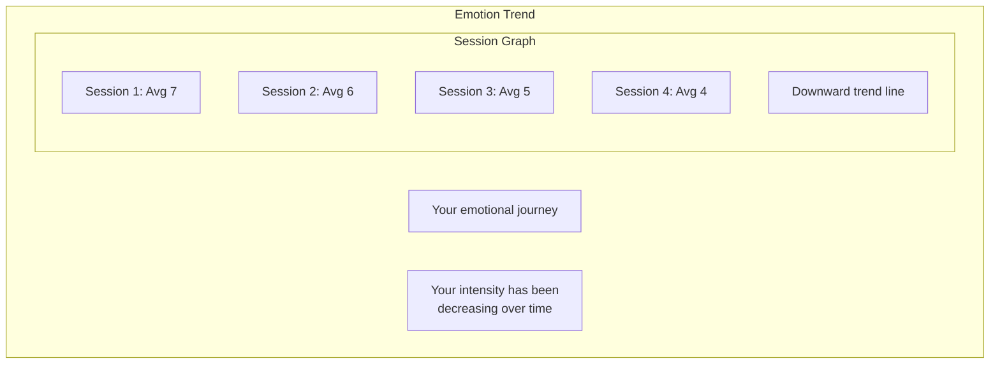

## Private Journaling Interface

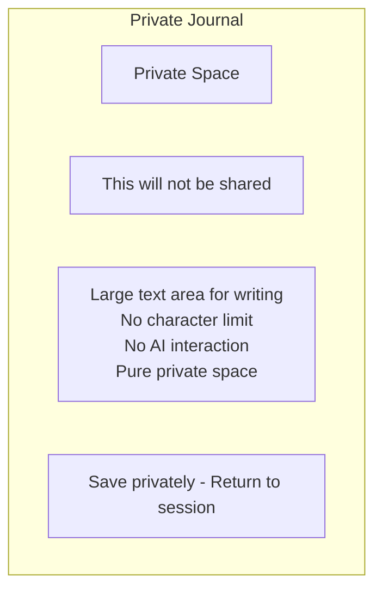

## Mobile Adaptations

### Compact Mobile Emotion Check

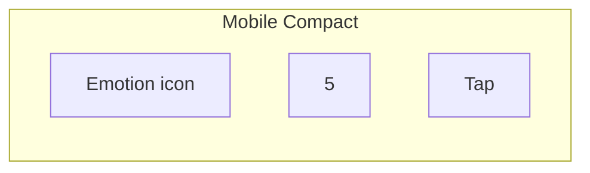

### Mobile Full Screen Cooling

On mobile, cooling period takes full screen:

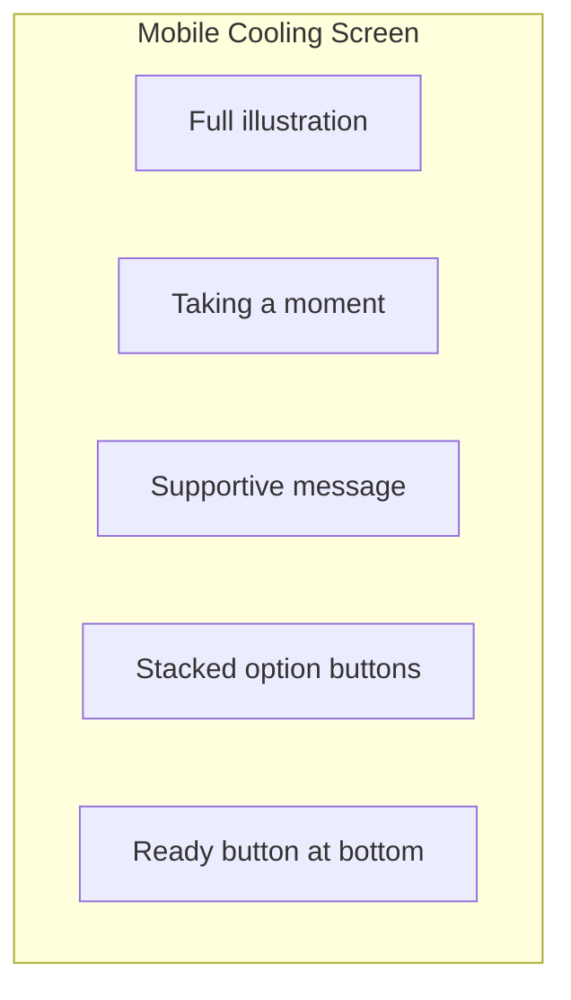

## Accessibility Considerations

| Feature | Implementation |
|---------|---------------|
| Color-blind friendly | Icons and labels, not just color |
| Screen reader | Descriptive labels for all states |
| Keyboard navigation | Full keyboard control of slider |
| Reduced motion | Option to disable animations |
| High contrast | Sufficient contrast in all states |

---

## Related Documents

- [Emotional Barometer Mechanism](../mechanisms/emotional-barometer.md)
- [Chat Interface](./chat-interface.md)
- [Core Layout](./core-layout.md)

---

[Back to Wireframes](./index.md) | [Back to Plans](../index.md)
