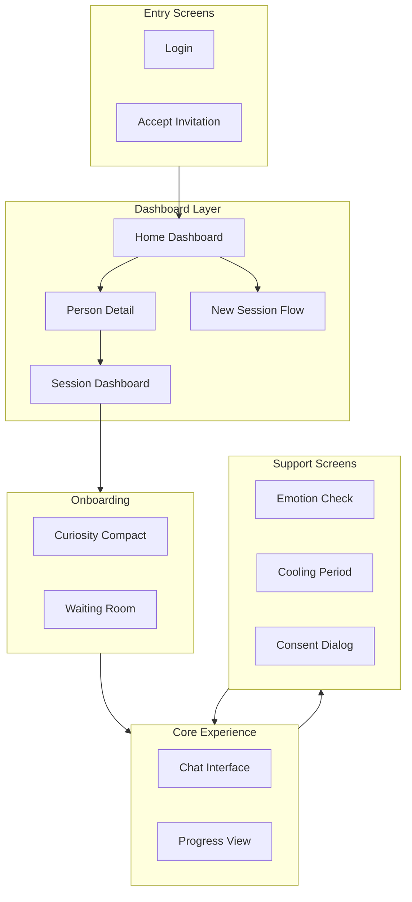

# Wireframes

UI concepts and screen layouts for key BeHeard interfaces.

## Documents

### Navigation & Dashboard
- **[Home Dashboard](./home-dashboard.md)** - Primary landing screen with smart hero card
- **[Person Detail](./person-detail.md)** - Relationship view with session history
- **[Session Dashboard](./session-dashboard.md)** - Preparation space before stage work
- **[New Session Flow](./new-session-flow.md)** - Invitation and session creation
- **[Authentication & First-Run](./auth-flow.md)** - Signup, login, and first-open states

### Core Experience
- **[Core Layout](./core-layout.md)** - Base app structure and navigation
- **[Chat Interface](./chat-interface.md)** - The primary conversation interface
- **[Stage Controls](./stage-controls.md)** - Stage progression and status UI
- **[Emotional Barometer UI](./emotional-barometer-ui.md)** - Emotion tracking interface
- **[Notifications UX](./notifications.md)** - Push, toast, inbox, and preferences

## Design Principles

| Principle | Rationale |
|-----------|-----------|
| Minimalist | Reduce cognitive load during emotional work |
| No typing indicators | Reduce pressure and comparison |
| Stage-controlled | UI adapts to current stage |
| Calm aesthetic | Support emotional regulation |
| Clear boundaries | Visual separation of private/shared content |

## Screen Overview

---

[Back to Plans](../index.md)
