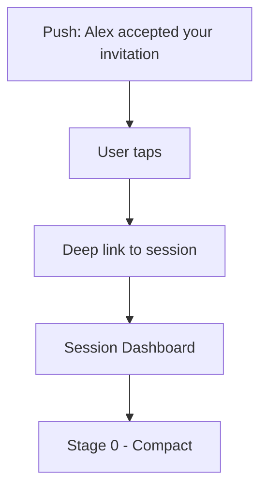
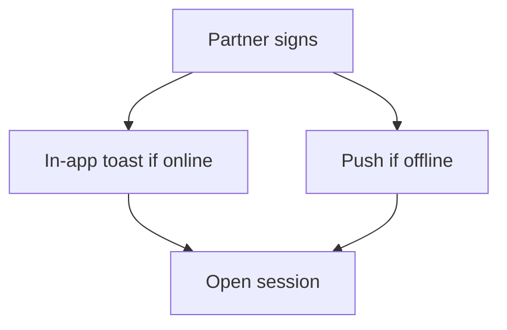
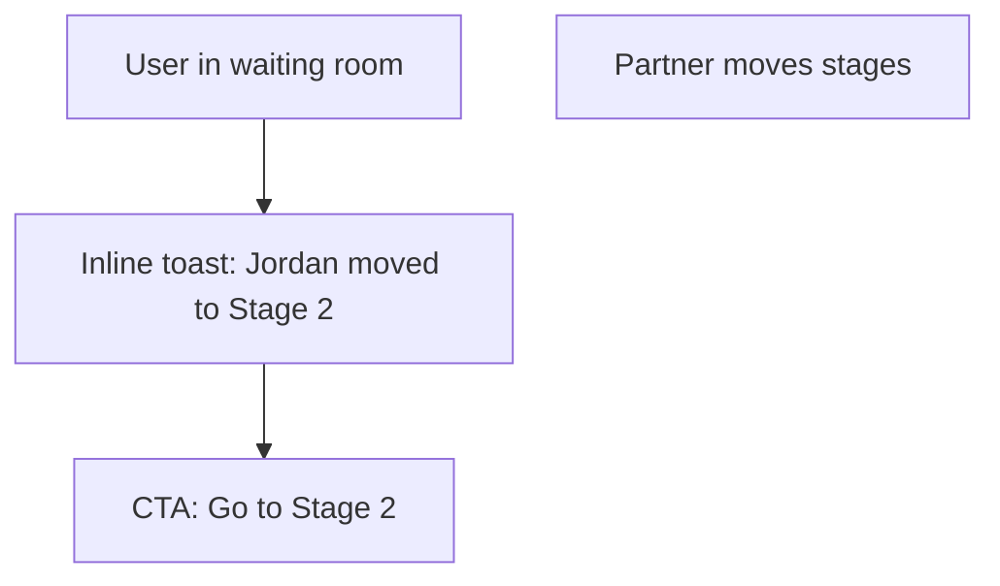
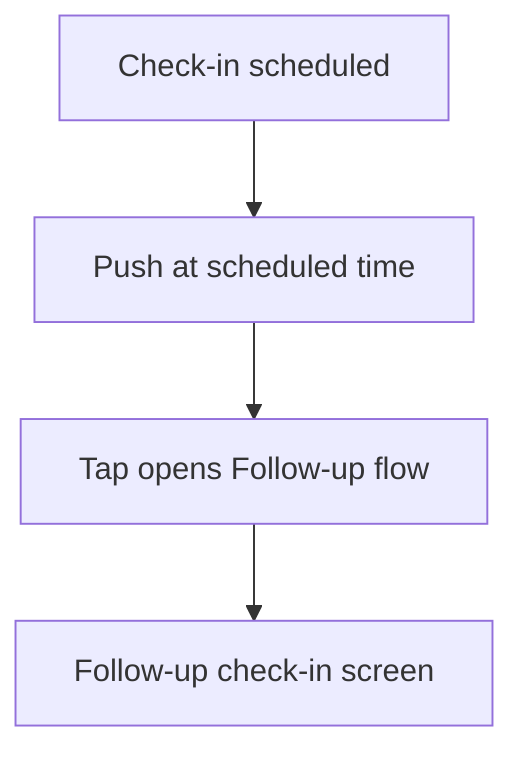

# Notifications UX

Notification surfaces for invitations, stage progress, cooling periods, and follow-ups.

## Surfaces

| Surface | Purpose |
|---------|---------|
| Push | Bring user back when offline (invite accepted, partner signed, follow-up) |
| In-app toast | Lightweight, transient updates while user is active |
| Inbox panel | Persistent list of recent events with deep links |
| Lock screen banner | System-level push preview |

## Flows

### Invitation Accepted

### Partner Signed Compact

### Waiting Room Updates

### Follow-up Reminder

## UI Patterns

- **Toast**: Compact banner at top; includes title, short body, CTA button. Auto-dismiss after 6s.
- **Inbox**: In header menu; shows chronological list with icons by type (invite, stage, follow-up). Items link to destination screens.
- **Badge**: Header icon badge count when unread > 0.
- **Preferences**: Toggle push + email; per-event toggles (invites, partner actions, follow-ups).

## Example Copy

| Event | Copy | CTA |
|-------|------|-----|
| Invite accepted | Alex accepted your invitation | Open session |
| Partner signed | Jordan signed the Curiosity Compact | Begin Stage 1 |
| Waiting update | Jordan moved to Stage 2 | Continue |
| Follow-up | How is your agreement going with Jordan? | Check in |

## States & Errors

| State | Behavior |
|-------|----------|
| Push denied | Inline banner prompting to enable notifications; link to OS settings |
| No network | Queue in-app notifications; show once online |
| Stale link | If deep link target is missing/expired, show friendly error with home CTA |

---

[Back to Wireframes](./index.md) | [Back to Plans](../index.md)
