# Stage Controls

UI elements that manage stage progression and status.

## Stage Progress Bar

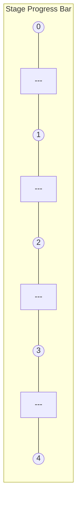

### State Styling

| State | Circle | Line | Label |
|-------|--------|------|-------|
| Complete | Filled + check | Solid | Stage name |
| Current | Highlighted ring | Dashed | Stage name + status |
| Locked | Empty + lock | Dotted | Stage name (grayed) |

### With Partner Status

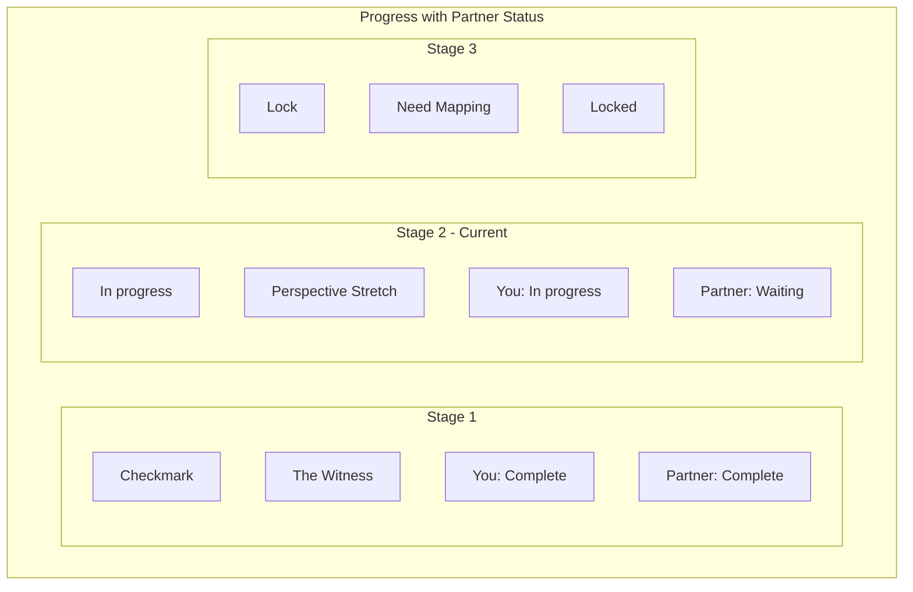

## Gate Status Indicators

### Gate Not Satisfied

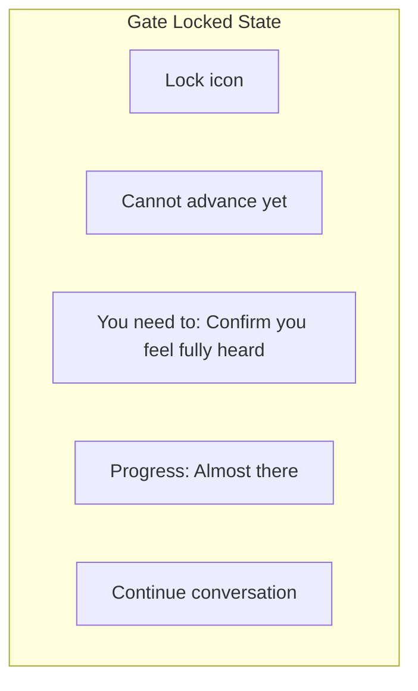

### Gate Satisfied - Waiting for Partner

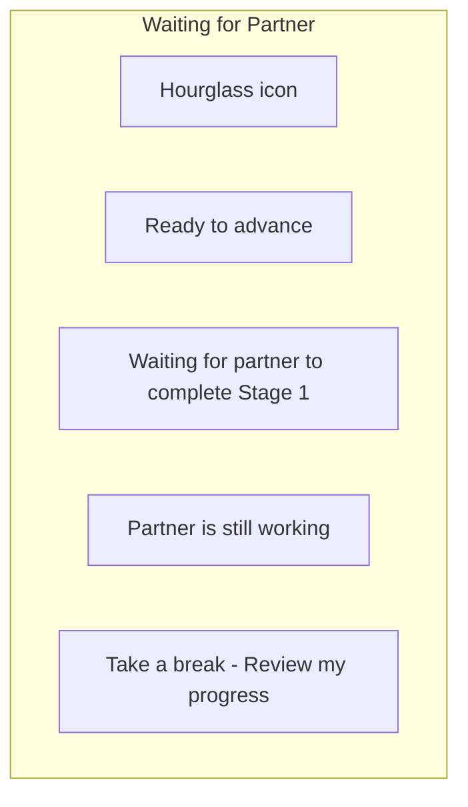

### Gate Satisfied - Can Advance

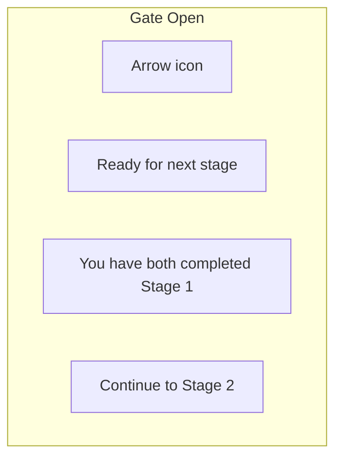

## Stage Completion Confirmation

### Generic Confirmation Pattern

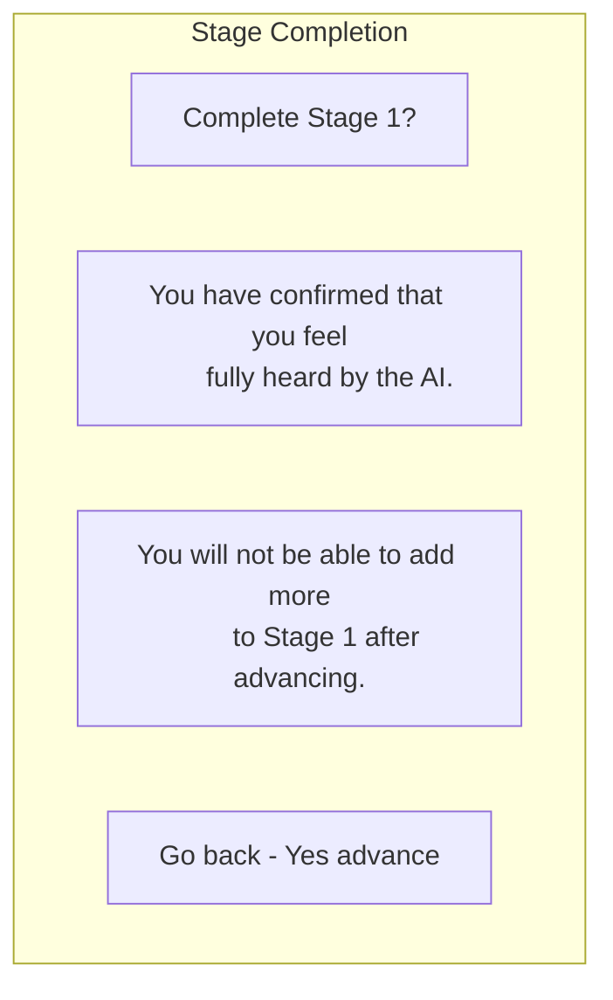

### Stage-Specific Confirmations

**Stage 0 - Signing Compact:**
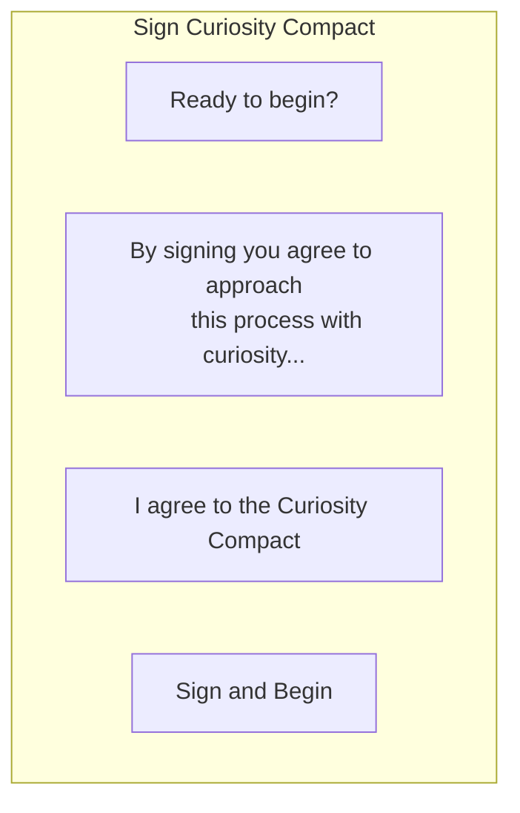

**Stage 1 - Feeling Heard:**
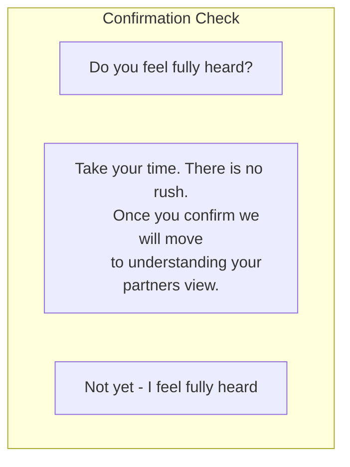

**Stage 4 - Agreement:**
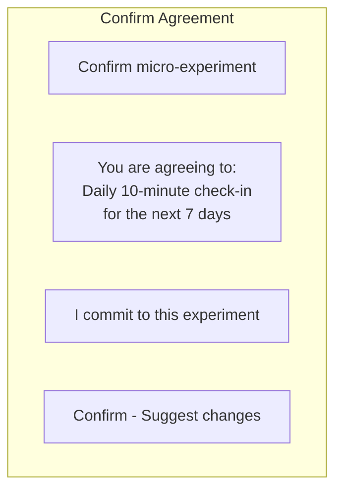

## Stage Header Variations

### Current Active Stage

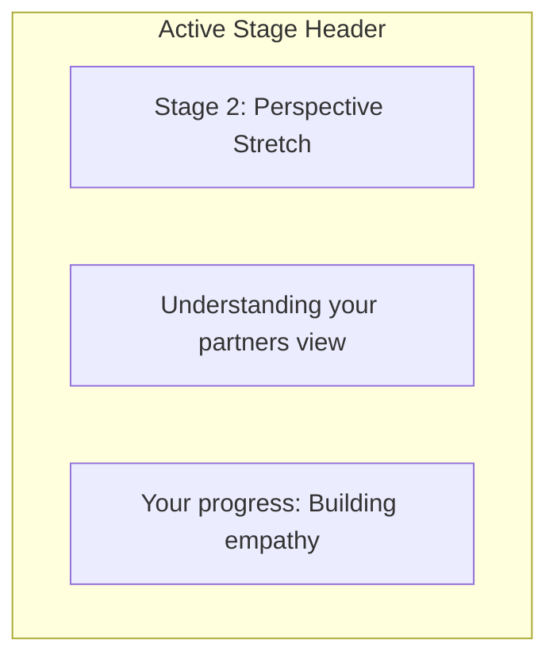

### Completed Stage (Review Mode)

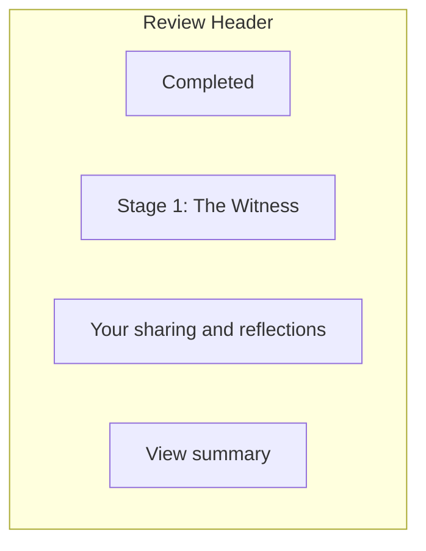

### Locked Stage (Preview)

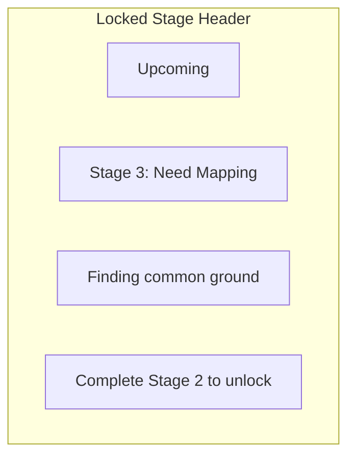

## Mobile Stage Controls

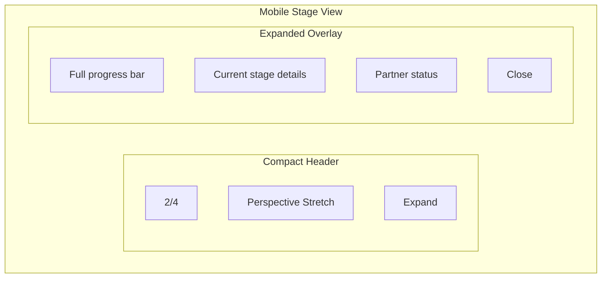

## Stage Transition Animation

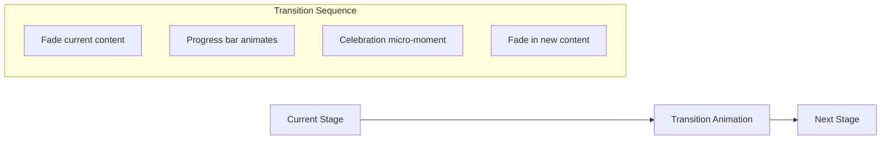

---

## Related Documents

- [Core Layout](./core-layout.md)
- [Chat Interface](./chat-interface.md)
- [Stages Overview](../stages/index.md)

---

[Back to Wireframes](./index.md) | [Back to Plans](../index.md)
